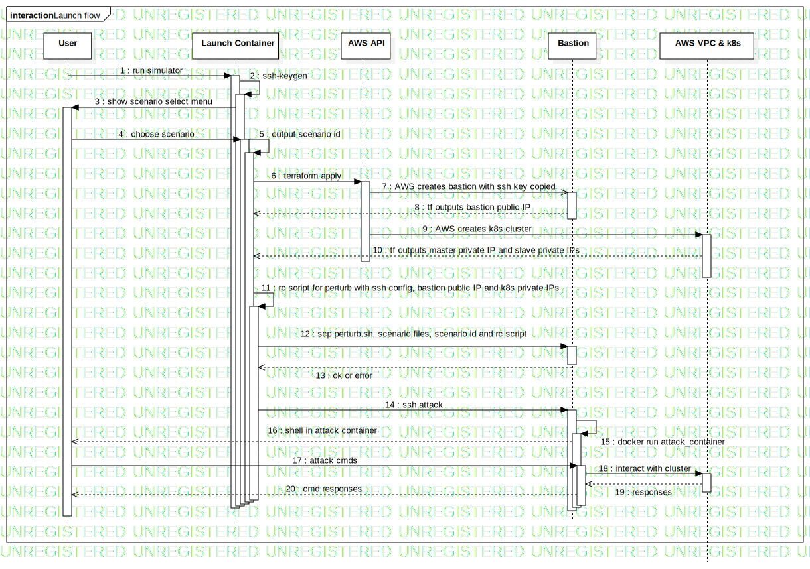

# Standalone simulator

A distributed systems and infrastructure simulator for attacking and debugging Kubernetes

## Sequence Diagram

- **User** - the end user who is operating the standalone Simulator CLI tool in order to create a cluster with a running scenario
- **Launch Container** - a Docker container image in which the simulator tooling runs (Terraform, and triggering the perturb scripts); this runs in a container to encpasulte dependencies for portability
- **AWS API** - Terraform interacts with AWS APIs in order to create a VPC and EC2 instances for the bastion host and Kubernetes cluster
- **Bastion** - EC2 instance in the same VPC as the Kubernetes cluster from which the perturb scripts are run. The launch container will first generate an SSH key that can be used by Terraform to access the bastion
- **AWS VPC & k8s** - VPC in which the Bastion and k8s cluster nodes sit
