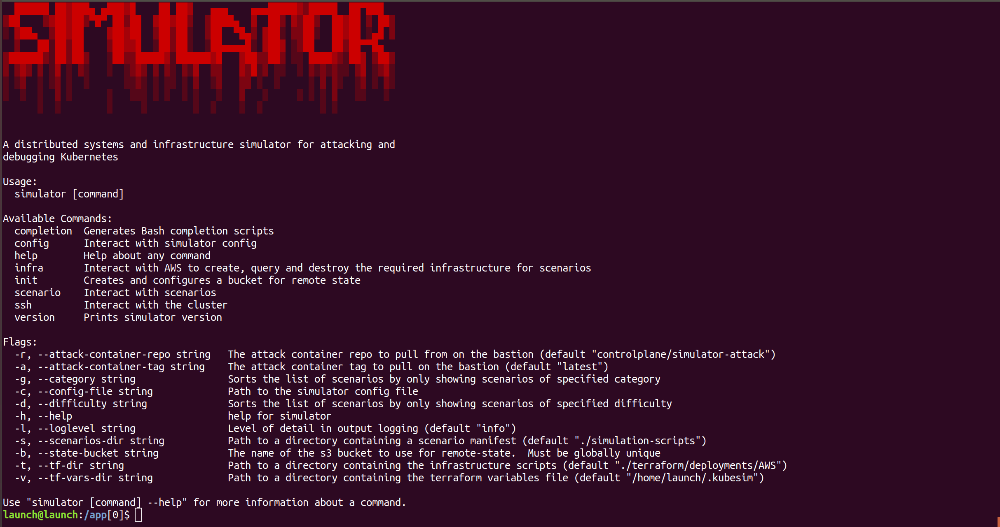
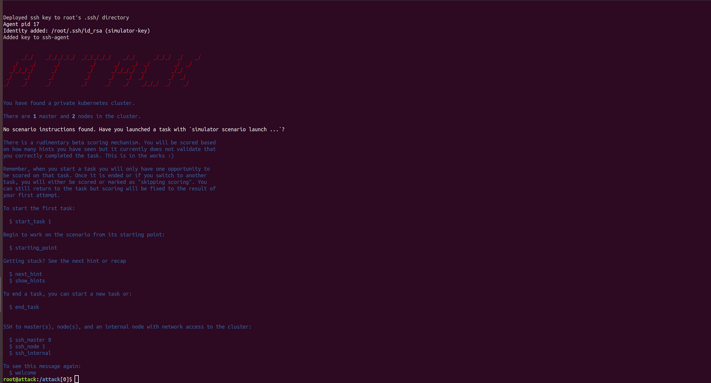
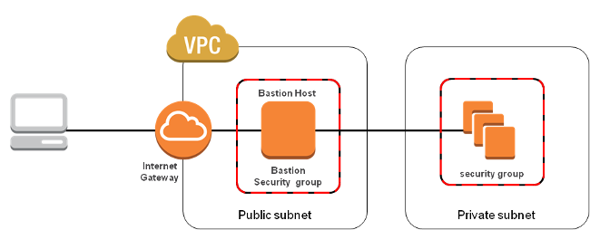

<!--

NOTICE: THIS FILE IS AUTOGENERATED FROM doc-templates/README.template.md

This file is evaled by a quickly cobbled together bash script to replace the variables.

Backticks are imterpreted by bash so use <code> for inline code and <pre> for code blocks.

If you need to include bsah code snippets you will need to change how the templating works.

-->

# Simulator

A distributed systems and infrastructure simulator for attacking and debugging
Kubernetes: <code>simulator</code> creates a kuberntes cluster for you in your AWS
account; runs scenarios which misconfigure it and/or leave it vulnerable to
compromise and trains you in mitigating against these vulnerabilities.

## Before you start

## Usage

Ensure the [AWS requirements](#aws-configuration) are met and configured.

The quickest way to get up and running is to simply:

<pre>
source <(curl https://raw.githubusercontent.com/kubernetes-simulator/simulator/master/kubesim)
</pre>

or clone this repository and run:

<pre>
make run
</pre>

This will drop you into a bash shell in a launch container.  You will have a
program on the <code>PATH</code> named <code>simulator</code> to interact with.

Refer to [Simulator CLI Usage](#simulator-cli-usage)

### Simulator CLI Usage

_Create a remote state bucket for terraform_
<pre>
simulator init
</pre>
You will be asked for a name of a S3 bucket, which must be globally unique as pre AWS standards.  If this does not exist it will be created, else the existing bucket will be used.  This is used to store Terraform state to.

_Create the infra if it isn't there_
<pre>
simulator infra create
</pre>
This will standup the infrastructure, including an initial Kubernetes Cluster

_List available scenarios_
<pre>
simulator scenario list
</pre>
This will list all currently available scenrios

_Launch a scenario (sets up your cluster)_
<pre>
simulator scenario launch node-shock-tactics
</pre>
This will launch your selected scenario.

_Login the environment_
<pre>
simulator ssh attack
</pre>

Once you run <code>simulator ssh attack</code> you will be logged into a container running on the Bastion host.  Upon login an outline of the challenge will be displayed.  In addition, short cuts for logging into the master, or nodes, of the Kubernetes cluster are displayed.  Use these shortcuts to log into the correct starting point as outlined in the challenge.  **Note** that some starting points will require you are on the cluster first to access to starting point.

_Destroy your cluster when you are done_
<pre>
simulator infra destroy
</pre>
Once you have finished you **must** destroy the environment to ensure that no additional costs are incurred.

The following scenarios are available:

<pre>
     container-ambush
     container-defeat-in-detail
     container-phalanx-formation
     etcd-inverted-wedge
     master-bait-and-bleed
     master-encirclement
     network-feint
     network-hammer-and-anvil
     network-hedgehog-defence
     network-swarming
     node-amphibious-operations
     node-raiding
     node-shock-tactics
     policy-echelon-formation
     policy-fire-support
     policy-force-dispersal
     policy-vertical-envelopment
     rbac-contact-drill
     rbac-sangar
     rbac-flanking-maneuver
     rbac-shoot-and-scoot
     secret-high-ground
     secret-tank-desant
</pre>

## How It All Works

### Infrastructure Design

### AWS Configuration

Simulator uses terraform to provision its infrastructure.  Terraform in turn
honours [all the rules for configuring the AWS
CLI](https://docs.aws.amazon.com/cli/latest/userguide/cli-chap-configure.html#cli-environment).
Please follow these.

You can provide your credentials via the <code>AWS_ACCESS_KEY_ID</code> and
<code>AWS_SECRET_ACCESS_KEY</code>, environment variables, representing your AWS Access Key
and AWS Secret Key, respectively. Note that setting your AWS credentials using
either these (or legacy) environment variables will override the use of
<code>AWS_SHARED_CREDENTIALS_FILE</code> and <code>AWS_PROFILE</code>. The <code>AWS_DEFAULT_REGION</code> and
<code>AWS_SESSION_TOKEN</code> environment variables are also used, if applicable.

https://www.terraform.io/docs/backends/types/s3.html

**All the <code>AWS_*</code> configuration environment variables you have set will be propagated into the container**

#### Troubleshooting AWS

- If you get a timeout when running <code>simulator infra create</code> after about 10 minutes, the region you are using
is probably running slowly.  You must run <code>simulator infra destroy</code> and then retry <code>simulator infra
create</code>
- <code>AWS_REGION</code> vs <code>AWS_DEFAULT_REGION</code> - There have been
[some issues](https://github.com/aws/aws-sdk-go/issues/2103) with the
[Go AWS client region configuration](https://github.com/aws/aws-sdk-go#configuring-aws-region)
- [Multi-account](https://www.terraform.io/docs/backends/types/s3.html#multi-account-aws-architecture)

### Terraform

Refer to the [simulator terraform documentation](./terraform/README.md) 

### SSH

Simulator whether run in the launch container or on the host machine will generate its own SSH RSA key pair.  It will configure the cluster to allow access only with this keypair and automates writing SSH config and keyscanning the bastion on your behalf using custom SSH config and known_hosts files.  This keeps all simulator-related SSH config separate from any other configs you may have. All simulator-related SSH files are written to <code>~/.ssh</code> and are files starting <code>cp_simulator_</code>

**If you delete any of the files then simulator will recreate them and reconfigure the infrastructure as necessary on the
next run**

### The kubesim script

<code>kubesim</code> is a small script written in BASH for getting users up and running with simulator as fast as possible. It pulls the latest version of the simulator container and sets up some options for running the image. It can be installed with the following steps:

<pre>
# cURL the script from GitHub
curl -o kubesim https://raw.githubusercontent.com/kubernetes-simulator/simulator/master/kubesim
# Make it executeable
chmod a+x kubesim
# Place the script on your path
cp kubesim /usr/local/bin
</pre>

Feel free to modify and/or extend the script if you wish.

## Development Workflow

### Git hooks

To ensure all Git hooks are in place run the following

<pre>
make setup-dev
</pre>

Development targets are specified in the [Makefile](./Makefile).

<pre>
setup-dev             Initialise simulation tree with git hooks
devtools-deps: # Install devtools dependencies 
devtools              Install devtools
test-devtools: # Run all the unit tests for the devtools 
reset                 Clean up files left over by simulator
validate-requirements  Verify all requirements are met
previous-tag:        
release-tag:         
gpg-preflight:       
run                   Run the simulator - the build stage of the container runs all the cli tests
docker-build-no-cache  Builds the launch container
docker-build          Builds the launch container
docker-test           Run the tests
dep                   Install dependencies for other targets
build                 Run golang build for the CLI program
is-in-launch-container  checks you are running in the launch container
test                  run all tests except goss tests
test-acceptance       Run tcl acceptance tests for the CLI program
test-smoke            Run expect smoke test to check happy path works end-to-end
test-unit             Run golang unit tests for the CLI program
test-cleanup          cleans up automated test artefacts if e.g. you ctrl-c abort a test run
test-coverage         Run golang unit tests with coverage and opens a browser with the results
docs                  Generate documentation
release: gpg-preflight previous-tag release-tag docker-test docker-build build 
</pre>

### Git commits

We follow [the conventional commit specification](https://www.conventionalcommits.org/en/v1.0.0-beta.4/).
Please ensure your commit messages adhere to this spec.  If you submit a pull request
without following them be aware we will squash and merge your work with a message
that does.

## Architecture

### [Launching a scenario](./docs/launch.md)

### *TODO* [Validating a scenario](./docs/validation.md)

### *TODO* [Evaluating  scenario progress](./docs/evaluation.md)

### Components

* [Simulator CLI tool](./cmd) - Runs in the launch container and orchestrates everything
* [Launch container](./Dockerfile) - Isolates the scripts from the host
* [Terraform Scripts for infrastructure provisioning](./terraform) - AWS infra
* [Perturb.sh](./simulation-scripts/perturb.sh) - sets up a scenario on a cluster
* [Scenarios](./simulation-scripts/scenario)
* [Attack container](./attack) - Runs on the bastion providing all the tools needed to attack a
cluster in the given cloud provider

### Specifications

* [tasks.yaml format](./docs/tasks-yaml-format.md)

* If you need to make changes to the format you should update this documentation.
* Any changes should be accompanied by a bump of the version in the <code>kind</code>
property
* Use the <code>migrate-hints</code> devtool to update the existing scenarios en-masse.
You can make this tool available on your PATH by running <code>make devtools</code>

### Simulator API Documentation

* [Scenario](./docs/api/scenario.md)
* [Simulator](./docs/api/simulator.md)
* [Util](./docs/api/util.md)

## Contributing

### Bugs

If you think you have found a bug please follow the instructions below.

- Please spend a small amount of time giving due diligence to the issue tracker. Your issue might be a duplicate.
- Open a [new issue](https://github.com/kubernetes-simulator/simulator/issues/new) if a duplicate doesn't already exist.
- Note the version of simulator you are running and the command line options you are using.
- Note the version of Kubernetes you are running.
- Remember users might be searching for your issue in the future, so please give it a meaningful title to help others.

### Pull Requests 

We welcome pull requests! 

- Your PR is more likely to be accepted if it focuses on just one change.
- Please include a comment with the results before and after your change. 
- Your PR is more likely to be accepted if it includes tests.
- You're welcome to submit a draft PR if you would like early feedback on an idea or an approach. 
- Happy coding!
