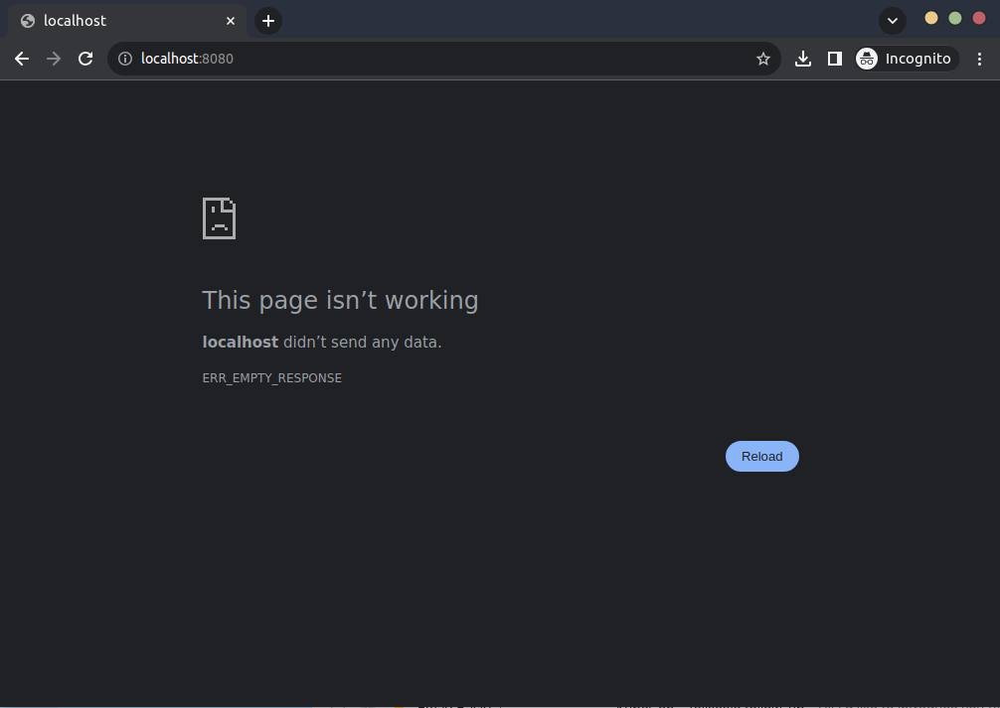
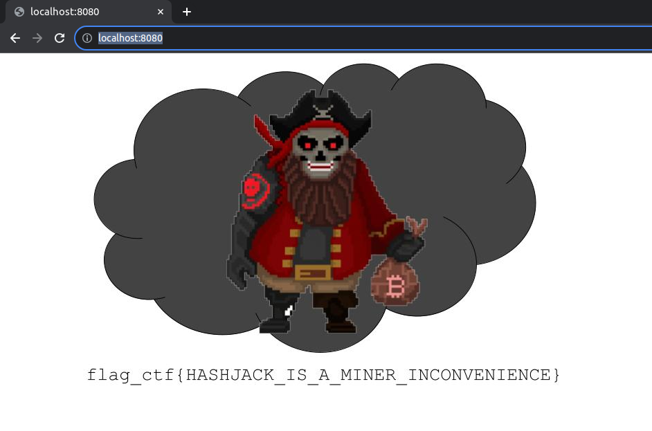

# Scenario: Build a Backdoor

- [Learning Outcomes](#learning-outcomes)
- [Challenge Description](#challenge-description)
- [Guided Walkthrough](#guided-walkthrough)
  - [Step 1: Enumerate Resources and reviewing the To Do List](#step-1-enumerate-resources-and-reviewing-the-to-do-list)
  - [Step 2: Discovery of mgmt port in the ii-management-services pod](#step-2-discovery-of-mgmt-port-in-the-ii-management-services-pod)
  - [Step 3: Modifying the network policy, service and ingress](#step-3-modifying-the-network-policy-service-and-ingress)
  - [Step 4: Acquiring the flags and completing the challenge](#step-4-acquiring-the-flags-and-completing-the-challenge)
- [Remediation and Security Considerations](#remediation-and-security-considerations)

## Learning Outcomes

The purpose of Build a Backdoor is to provide hands-on experience of configuring Kubernetes Ingress, Services and Network Policy. In many CTF scenarios, participants are only required to remove network restrictions or create a new service to complete the challenge. Build a Backdoor is different as the service account permissions provided mean that each resource needs to patched with the correct configuration. Alongside this Kyverno is used on the cluster to enforce the custom policies and demonstrates the flexibility of admission control on Kubernetes.

## Challenge Description

```
                                                                                  |\
                                                                                  | \
                                                                                  |  \
                                                                                  |   \
                                                                      ____________|____\
                 _________-----_____                                 |                  |
        _____------           __      ----_                          |                  |
 ___----             ___------              \                        |   _____   _____  |
    ----________        ----                 \                       |  |     | |     | |
                -----__    |             _____)                      |  |     | |     | |
                     __-                /     \                      |  |_____| |_____| |
         _______-----    ___--          \    /)\                     |                  |
   ------_______      ---____            \__/  /                     |   _____   _____()|
                -----__    \ --    _          /\                     |  |     | |     | |
                       --__--__     \_____/   \_/\                   |  |     | |     | |
                               ----|   /          |                  |  |     | |     | |
                                   |  |___________|                  |  |     | |     | |
                                   |  | ((_(_)| )_)                  |  |     | |     | |
                                   |  \_((_(_)|/(_)                  |  |     | |     | |
                                   \             (                   |  |_____| |_____| |
                                    \_____________)                  |__________________|

Captain Hλ$ħ𝔍Ⱥ¢k has discovered an authentication bypass in a remote operations management port for SaaS management solution

Unfortunately Introspective Insight SecOps team have applied multiple security controls to restrict access to the service

As an insider, the Dread Pirate wants you to allow remote access to the operations management port for the exploit to fire

Remember you must be stealthy and ensure the current website continues to be publicly accessible

If successful, Captain Hλ$ħ𝔍Ⱥ¢k will drop you a secret payment for your malicious actions. Good Luck!
```

## Guided Walkthrough

### Step 1: Enumerate Resources and reviewing the To Do List

The first step is to enumerate internal and external resources. Our initial access is in a `jumpbox-terminal` as the `root` user. A quick `ls` reveals a `todolist.md` file which contains the following:

```bash
root@jumpbox-terminal:~# cat todolist.md
# To Do List

1. SMTP forwarder for contact form
2. Create an backlog item for the development team to remove the operations mgmt port on the ii management service
3. Clean up any misconfigured and failed helm deployments, noticed ii-pord was hanging around
4. Research using a load balancer instead of using nodeport for ingress
5. Speak to SecOps about getting access to the Kyverno policies they've deployed
6. Review AI engine with development team and figure out cluster resource requirements
7. Use the bastion ssh access to nodeport 30080 to check website is working `ssh -F cp_simulator_config -L 8080:localhost:8080 -N bastion`
```

The to do list, has a few interesting snippets that we need to note down.

1. There is a `mgmt port` enabled on the `ii management service` which is part of our objective
2. Potentially there is a misconfigured environment called `ii-pord`
3. Ingress is configured with a nodeport rather than a load balancer
4. It seems a Kyverno is being used to enforce security controls which may hinder our ability to expose the `mgmt port`
5. We can check the website of Introspective Insight by using `ssh -F cp_simulator_config -L 8080:localhost:8080 -N bastion`

Let's quickly check the website is working by running the command above and then navigating to `http://localhost:8080` in our browser.

```bash
ssh -F cp_simulator_config -L 8080:localhost:8080 -N bastion
```



Seems like we cannot reach the website, potentially nodeport 30080 is pointing to another service.

Now let's see what access we have to the cluster. We can use `kubectl auth can-i` to achieve this:

```bash
root@jumpbox-terminal:~# kubectl auth can-i --list
Resources                                       Non-Resource URLs                     Resource Names   Verbs
selfsubjectaccessreviews.authorization.k8s.io   []                                    []               [create]
selfsubjectrulesreviews.authorization.k8s.io    []                                    []               [create]
namespaces                                      []                                    []               [get list]
                                                [/.well-known/openid-configuration]   []               [get]
                                                [/api/*]                              []               [get]
                                                [/api]                                []               [get]
                                                [/apis/*]                             []               [get]
                                                [/apis]                               []               [get]
                                                [/healthz]                            []               [get]
                                                [/healthz]                            []               [get]
                                                [/livez]                              []               [get]
                                                [/livez]                              []               [get]
                                                [/openapi/*]                          []               [get]
                                                [/openapi]                            []               [get]
                                                [/openid/v1/jwks]                     []               [get]
                                                [/readyz]                             []               [get]
                                                [/readyz]                             []               [get]
                                                [/version/]                           []               [get]
                                                [/version/]                           []               [get]
                                                [/version]                            []               [get]
                                                [/version]                            []               [get]
```

The output shows that we have access to the `namespaces` so let's look at what namespaces are available:

```bash
root@jumpbox-terminal:~# kubectl get namespaces
NAME              STATUS   AGE
default           Active   76m
dmz               Active   75m
ii-pord           Active   75m
ii-prod           Active   75m
ingress-nginx     Active   75m
kube-node-lease   Active   76m
kube-public       Active   76m
kube-system       Active   76m
kyverno           Active   75m
```

We can see the `ii-prod` namespace but also what was in the to do list, `ii-pord`. If we enumerate each namespace we find the following interesting permissions:

```bash
root@jumpbox-terminal:~# kubectl auth can-i --list -n ingress-nginx
Resources                                       Non-Resource URLs                     Resource Names   Verbs
selfsubjectaccessreviews.authorization.k8s.io   []                                    []               [create]
selfsubjectrulesreviews.authorization.k8s.io    []                                    []               [create]
namespaces                                      []                                    []               [get list]
services                                        []                                    []               [get list]
                                                [/.well-known/openid-configuration]   []               [get]
                                                [/api/*]                              []               [get]
                                                [/api]                                []               [get]
                                                [/apis/*]                             []               [get]
                                                [/apis]                               []               [get]
                                                [/healthz]                            []               [get]
                                                [/healthz]                            []               [get]
                                                [/livez]                              []               [get]
                                                [/livez]                              []               [get]
                                                [/openapi/*]                          []               [get]
                                                [/openapi]                            []               [get]
                                                [/openid/v1/jwks]                     []               [get]
                                                [/readyz]                             []               [get]
                                                [/readyz]                             []               [get]
                                                [/version/]                           []               [get]
                                                [/version/]                           []               [get]
                                                [/version]                            []               [get]
                                                [/version]                            []               [get]
```

```bash
root@jumpbox-terminal:~# kubectl auth can-i --list -n ii-prod
Resources                                       Non-Resource URLs                     Resource Names   Verbs
selfsubjectaccessreviews.authorization.k8s.io   []                                    []               [create]
selfsubjectrulesreviews.authorization.k8s.io    []                                    []               [create]
services                                        []                                    []               [get list patch update]
ingresses.networking.k8s.io                     []                                    []               [get list patch update]
networkpolicies.networking.k8s.io               []                                    []               [get list patch update]
configmaps                                      []                                    []               [get list watch]
endpoints                                       []                                    []               [get list watch]
pods                                            []                                    []               [get list watch]
secrets                                         []                                    []               [get list watch]
namespaces                                      []                                    []               [get list]
                                                [/.well-known/openid-configuration]   []               [get]
                                                [/api/*]                              []               [get]
                                                [/api]                                []               [get]
                                                [/apis/*]                             []               [get]
                                                [/apis]                               []               [get]
                                                [/healthz]                            []               [get]
                                                [/healthz]                            []               [get]
                                                [/livez]                              []               [get]
                                                [/livez]                              []               [get]
                                                [/openapi/*]                          []               [get]
                                                [/openapi]                            []               [get]
                                                [/openid/v1/jwks]                     []               [get]
                                                [/readyz]                             []               [get]
                                                [/readyz]                             []               [get]
                                                [/version/]                           []               [get]
                                                [/version/]                           []               [get]
                                                [/version]                            []               [get]
                                                [/version]                            []               [get]
```

```bash
root@jumpbox-terminal:~# kubectl auth can-i --list -n ii-pord
Resources                                       Non-Resource URLs                     Resource Names   Verbs
selfsubjectaccessreviews.authorization.k8s.io   []                                    []               [create]
selfsubjectrulesreviews.authorization.k8s.io    []                                    []               [create]
configmaps                                      []                                    []               [get list watch]
endpoints                                       []                                    []               [get list watch]
pods                                            []                                    []               [get list watch]
services                                        []                                    []               [get list watch]
namespaces                                      []                                    []               [get list]
ingresses.networking.k8s.io                     []                                    []               [get list]
networkpolicies.networking.k8s.io               []                                    []               [get list]
                                                [/.well-known/openid-configuration]   []               [get]
                                                [/api/*]                              []               [get]
                                                [/api]                                []               [get]
                                                [/apis/*]                             []               [get]
                                                [/apis]                               []               [get]
                                                [/healthz]                            []               [get]
                                                [/healthz]                            []               [get]
                                                [/livez]                              []               [get]
                                                [/livez]                              []               [get]
                                                [/openapi/*]                          []               [get]
                                                [/openapi]                            []               [get]
                                                [/openid/v1/jwks]                     []               [get]
                                                [/readyz]                             []               [get]
                                                [/readyz]                             []               [get]
                                                [/version/]                           []               [get]
                                                [/version/]                           []               [get]
                                                [/version]                            []               [get]
                                                [/version]                            []               [get]
```

First up, we can `get` and `list` services in the `ingress-nginx` namespace. Next, we see that our permissions to `ii-prod` and `ii-pord` are almost identical, only we are able to modify the resources in `ii-prod` and only view the resources in `ii-pord`.

Let's check if any services are available in the `ingress-nginx` namespace:

```bash
root@jumpbox-terminal:~# kubectl get services -n ingress-nginx
NAME                       TYPE       CLUSTER-IP    EXTERNAL-IP   PORT(S)                      AGE
ingress-nginx-controller   NodePort   10.99.52.22   <none>        80:30731/TCP,443:31628/TCP   96m
```

We can see the node ports configured for the `ingress-nginx-controller` service. As we cannot modify this, we'll make a note and move to review the `ii-prod` and `ii-pord` namespaces.

Looking at the `ii-pord` namespace, we find a service running and it's pointing to where the website should be. As no pods are running, then the empty resource response we received is correct. There is a network policy in place which matches the pod-selector `app=ii` and the only config map is the `kube-root-ca.crt` which is used for the cluster CA.

```bash
root@jumpbox-terminal:~# kubectl get services -n ii-pord
NAME                   TYPE       CLUSTER-IP      EXTERNAL-IP   PORT(S)        AGE
ii-pord-mgmt-service   NodePort   10.97.103.252   <none>        80:30080/TCP   100m

root@jumpbox-terminal:~# kubectl get pods -n ii-pord
No resources found in ii-pord namespace.

root@jumpbox-terminal:~# kubectl get configmaps -n ii-pord
NAME               DATA   AGE
kube-root-ca.crt   1      103m

root@jumpbox-terminal:~# kubectl get ingress -n ii-pord
No resources found in ii-pord namespace.

root@jumpbox-terminal:~# kubectl get endpoints -n ii-pord
NAME                   ENDPOINTS   AGE
ii-pord-mgmt-service   <none>      104m

root@jumpbox-terminal:~# kubectl get networkpolicies -n ii-pord
NAME              POD-SELECTOR   AGE
ii-pord-mgmt-np   app=ii         117m

root@jumpbox-terminal:~# kubectl get configmaps -n ii-pord
NAME               DATA   AGE
kube-root-ca.crt   1      121m
```

Now let's point our attention to the `ii-prod` namespace.

```bash
root@jumpbox-terminal:~# kubectl get services -n ii-prod
NAME                   TYPE        CLUSTER-IP    EXTERNAL-IP   PORT(S)   AGE
ii-prod-mgmt-service   ClusterIP   10.97.95.34   <none>        80/TCP    116m

root@jumpbox-terminal:~# kubectl get pods -n ii-prod
NAME                     READY   STATUS    RESTARTS   AGE
ii-management-services   1/1     Running   0          116m

root@jumpbox-terminal:~# kubectl get ingress -n ii-prod
NAME              CLASS    HOSTS   ADDRESS      PORTS   AGE
ingress-ii-mgmt   <none>   *       172.31.2.8   80      117m

root@jumpbox-terminal:~# kubectl get endpoints -n ii-prod
NAME                   ENDPOINTS             AGE
ii-prod-mgmt-service   192.168.11.194:8080   118m

root@jumpbox-terminal:~# kubectl get networkpolicies -n ii-prod
NAME              POD-SELECTOR   AGE
ii-prod-mgmt-np   app=ii         118m
```

The enumeration has finally revealed a workload to us, the `ii-management-services` pod.

### Step 2: Discovery of mgmt port in the ii-management-services pod

Let's delve into the `ii-management-services` pod and see what we can find. We can do this by using the output flag to a file format such as `json` or `yaml`.

```bash
root@jumpbox-terminal:~# kubectl get pod ii-management-services -n ii-prod -oyaml
```

```yaml
apiVersion: v1
kind: Pod
metadata:
  annotations:
    cni.projectcalico.org/containerID: 64c05918738ce25d91e440829d2aa967bba25940e14e16fda48d4190d4891feb
    cni.projectcalico.org/podIP: 192.168.11.194/32
    cni.projectcalico.org/podIPs: 192.168.11.194/32
    kubectl.kubernetes.io/last-applied-configuration: |
      {"apiVersion":"v1","kind":"Pod","metadata":{"annotations":{},"labels":{"app":"ii"},"name":"ii-management-services","namespace":"ii-prod"},"spec":{"containers":[{"env":[{"name":"AUTH_USERID","valueFrom":{"secretKeyRef":{"key":"username","name":"ops-mgmt"}}},{"name":"AUTH_PASSWORD","valueFrom":{"secretKeyRef":{"key":"password","name":"ops-mgmt"}}}],"image":"controlplaneoffsec/build-a-backdoor:ii-app","name":"ii-website","ports":[{"containerPort":8080,"name":"web"},{"containerPort":5724,"name":"ops-mgmt"}],"securityContext":{"allowPrivilegeEscalation":false}}],"restartPolicy":"Always"}}
  creationTimestamp: "2023-11-22T08:24:38Z"
  labels:
    app: ii
  name: ii-management-services
  namespace: ii-prod
  resourceVersion: "1042"
  uid: ac527be9-1ebf-4dc8-b4fb-d0c9604a7714
spec:
  containers:
  - env:
    - name: AUTH_USERID
      valueFrom:
        secretKeyRef:
          key: username
          name: ops-mgmt
    - name: AUTH_PASSWORD
      valueFrom:
        secretKeyRef:
          key: password
          name: ops-mgmt
    image: controlplaneoffsec/build-a-backdoor:ii-app
    imagePullPolicy: IfNotPresent
    name: ii-website
    ports:
    - containerPort: 8080
      name: web
      protocol: TCP
    - containerPort: 5724
      name: ops-mgmt
      protocol: TCP
    resources: {}
    securityContext:
      allowPrivilegeEscalation: false
    terminationMessagePath: /dev/termination-log
    terminationMessagePolicy: File
    volumeMounts:
    - mountPath: /var/run/secrets/kubernetes.io/serviceaccount
      name: kube-api-access-6cr44
      readOnly: true
  dnsPolicy: ClusterFirst
  enableServiceLinks: true
  nodeName: k8s-node-0
  preemptionPolicy: PreemptLowerPriority
  priority: 0
  restartPolicy: Always
  schedulerName: default-scheduler
  securityContext: {}
  serviceAccount: default
  serviceAccountName: default
  terminationGracePeriodSeconds: 30
  tolerations:
  - effect: NoExecute
    key: node.kubernetes.io/not-ready
    operator: Exists
    tolerationSeconds: 300
  - effect: NoExecute
    key: node.kubernetes.io/unreachable
    operator: Exists
    tolerationSeconds: 300
  volumes:
  - name: kube-api-access-6cr44
    projected:
      defaultMode: 420
      sources:
      - serviceAccountToken:
          expirationSeconds: 3607
          path: token
      - configMap:
          items:
          - key: ca.crt
            path: ca.crt
          name: kube-root-ca.crt
      - downwardAPI:
          items:
          - fieldRef:
              apiVersion: v1
              fieldPath: metadata.namespace
            path: namespace
status:
  conditions:
  - lastProbeTime: null
    lastTransitionTime: "2023-11-22T08:24:38Z"
    status: "True"
    type: Initialized
  - lastProbeTime: null
    lastTransitionTime: "2023-11-22T08:24:48Z"
    status: "True"
    type: Ready
  - lastProbeTime: null
    lastTransitionTime: "2023-11-22T08:24:48Z"
    status: "True"
    type: ContainersReady
  - lastProbeTime: null
    lastTransitionTime: "2023-11-22T08:24:38Z"
    status: "True"
    type: PodScheduled
  containerStatuses:
  - containerID: containerd://e165eabfee0cc99590d221be7e207e3d18fbc3daf879f5eeb3a4ab7d5a7843ea
    image: docker.io/controlplaneoffsec/build-a-backdoor:ii-app
    imageID: docker.io/controlplaneoffsec/build-a-backdoor@sha256:6946d85074fdbf76869d130e910d52d15ee4b7cb0b07a092ab93278b1096f623
    lastState: {}
    name: ii-website
    ready: true
    restartCount: 0
    started: true
    state:
      running:
        startedAt: "2023-11-22T08:24:47Z"
  hostIP: 172.31.2.8
  phase: Running
  podIP: 192.168.11.194
  podIPs:
  - ip: 192.168.11.194
  qosClass: BestEffort
  startTime: "2023-11-22T08:24:38Z"
```

The pod spec reveals a few interesting things. We can see that the pod has a label of `app: ii` associated with it which is likely used for the service and network policy. Next we find two ports exposed, `8080` and `5724`. The `8080` port is used for the website and the `5724` port is for `ops-mgmt` or operations management. This is the port we needed to find and expose for [[>>QAIS Formatting is going weird for me here. It's the only place]] Captain Hλ$ħ𝔍Ⱥ¢k to exploit. We can also see that the port is configured with a specific username and password. We shouldn't worry about this as soon as we expose it, `Captain Hλ$ħ𝔍Ⱥ¢k` will do the rest.

As reminder, we cannot modify the pod so our focus is on what we can change which is:

1. The network policy `ii-prod-mgmt-np`
2. The service `ii-prod-mgmt-service`
3. The ingress resource `ingress-ii-mgmt`

So let's start from top of the list and ensure that we can expose the `ops-mgmt` port correctly.

### Step 3: Modifying the network policy, service and ingress

Let's first review the network policy

```bash
root@jumpbox-terminal:~# kubectl get networkpolicy ii-prod-mgmt-np -n ii-prod -oyaml
```

```yaml
apiVersion: networking.k8s.io/v1
kind: NetworkPolicy
metadata:
  annotations:
    kubectl.kubernetes.io/last-applied-configuration: |
      {"apiVersion":"networking.k8s.io/v1","kind":"NetworkPolicy","metadata":{"annotations":{},"name":"ii-prod-mgmt-np","namespace":"ii-prod"},"spec":{"ingress":[{"ports":[{"port":8080}]}],"podSelector":{"matchLabels":{"app":"ii"}},"policyTypes":["Ingress"]}}
  creationTimestamp: "2023-11-22T08:24:38Z"
  generation: 1
  name: ii-prod-mgmt-np
  namespace: ii-prod
  resourceVersion: "937"
  uid: 9e31c402-5983-45c7-a7e5-49fc872a4e7d
spec:
  ingress:
  - ports:
    - port: 8080
      protocol: TCP
  podSelector:
    matchLabels:
      app: ii
  policyTypes:
  - Ingress
status: {}
```

Currently the network policy is only allowing ingress traffic on port `8080` and is applied to pods with the label `app: ii`. We need to modify this to allow traffic on port `5724` as well. We can do this by patching the network policy with the following:

```yaml
apiVersion: networking.k8s.io/v1
kind: NetworkPolicy
metadata:
  name: ii-prod-mgmt-np
  namespace: ii-prod
spec:
  ingress:
  - ports:
    - port: 8080
      protocol: TCP
    - port: 5724
      protocol: TCP
  podSelector:
    matchLabels:
      app: ii
  policyTypes:
  - Ingress
status: {}
```

Let's create this on the `jumpbox-terminal` and apply it to the cluster.

> Note: You will need to install your preferred text editor on the `jumpbox-terminal` to create the file. This can be achieved with `apt update && apt install -y <text-editor>`

```bash
root@jumpbox-terminal:~# kubectl apply -f np.yaml
networkpolicy.networking.k8s.io/ii-prod-mgmt-np configured
```

> Note: For more information about network policies, please see the official documentation [Kubernetes Network Policies](https://kubernetes.io/docs/concepts/services-networking/network-policies/). There is also an excellent resource here: [Network Policy Recipes](https://github.com/ahmetb/kubernetes-network-policy-recipes) which has examples of how to configure network policies.

Next on our list is the service, so let's inspect it and see what needs to be changed.

```bash
root@jumpbox-terminal:~# kubectl get service ii-prod-mgmt-service -n ii-prod -oyaml
```

```yaml
apiVersion: v1
kind: Service
metadata:
  annotations:
    kubectl.kubernetes.io/last-applied-configuration: |
      {"apiVersion":"v1","kind":"Service","metadata":{"annotations":{},"name":"ii-prod-mgmt-service","namespace":"ii-prod"},"spec":{"ports":[{"name":"web","port":80,"protocol":"TCP","targetPort":8080}],"selector":{"app":"ii"}}}
  creationTimestamp: "2023-11-22T08:24:38Z"
  name: ii-prod-mgmt-service
  namespace: ii-prod
  resourceVersion: "933"
  uid: 37dd955a-69bf-4ff9-8f5d-548128b2cfba
spec:
  clusterIP: 10.97.95.34
  clusterIPs:
  - 10.97.95.34
  internalTrafficPolicy: Cluster
  ipFamilies:
  - IPv4
  ipFamilyPolicy: SingleStack
  ports:
  - name: web
    port: 80
    protocol: TCP
    targetPort: 8080
  selector:
    app: ii
  sessionAffinity: None
  type: ClusterIP
status:
  loadBalancer: {}
```

The service is currently configured to expose port `80` and forward traffic to port `8080`. We need to modify this to expose port `5724` and forward traffic to port `5724`. We can do this by patching the service with the following:

```yaml
apiVersion: v1
kind: Service
metadata:
  name: ii-prod-mgmt-service
  namespace: ii-prod
spec:
  clusterIP: 10.97.95.34
  clusterIPs:
  - 10.97.95.34
  internalTrafficPolicy: Cluster
  ipFamilies:
  - IPv4
  ipFamilyPolicy: SingleStack
  ports:
  - name: web
    port: 80
    protocol: TCP
    targetPort: 8080
  - name: ops-mgmt
    port: 5724
    protocol: TCP
    targetPort: 5724
  selector:
    app: ii
  sessionAffinity: None
  type: ClusterIP
status:
  loadBalancer: {}
```

Once again, let's create this locally and apply it from the `jumpbox-terminal`.

```bash
root@jumpbox-terminal:~# kubectl apply -f svc.yaml
service/ii-prod-mgmt-service configured
```

> Note: For more information about services, please see the official documentation [Kubernetes Services](https://kubernetes.io/docs/concepts/services-networking/service/).

Finally, we need to modify the ingress resource. Let's inspect it and see what needs to be changed.

```bash
root@jumpbox-terminal:~# kubectl get ingress ingress-ii-mgmt -n ii-prod -oyaml
```

```yaml
apiVersion: networking.k8s.io/v1
kind: Ingress
metadata:
  annotations:
    kubectl.kubernetes.io/last-applied-configuration: |
      {"apiVersion":"networking.k8s.io/v1","kind":"Ingress","metadata":{"annotations":{"kubernetes.io/ingress.class":"nginx"},"name":"ingress-ii-mgmt","namespace":"ii-prod"},"spec":{"rules":[{"http":{"paths":[{"backend":{"service":{"name":"ii-prod-mgmt-service","port":{"number":80}}},"path":"/","pathType":"Prefix"}]}}]}}
    kubernetes.io/ingress.class: nginx
  creationTimestamp: "2023-11-22T08:24:39Z"
  generation: 1
  name: ingress-ii-mgmt
  namespace: ii-prod
  resourceVersion: "1229"
  uid: 48eb6b4d-ad31-479b-96d8-4ece95e1010c
spec:
  rules:
  - http:
      paths:
      - backend:
          service:
            name: ii-prod-mgmt-service
            port:
              number: 80
        path: /
        pathType: Prefix
status:
  loadBalancer:
    ingress:
    - ip: 172.31.2.8
```

So for ingress, we still want to point to our service but we want to add the port `5724` but we don't want to disrupt the current website path. So we'll create a new path `/backdoor` and point it to the service on port `5724`. The configuration looks like the following:

```yaml
apiVersion: networking.k8s.io/v1
kind: Ingress
metadata:
  annotations:
    kubernetes.io/ingress.class: nginx
  name: ingress-ii-mgmt
  namespace: ii-prod
spec:
  rules:
  - http:
      paths:
      - backend:
          service:
            name: ii-prod-mgmt-service
            port:
              number: 80
        path: /
        pathType: Prefix
      - backend:
          service:
            name: ii-prod-mgmt-service
            port:
              number: 5724
        path: /backdoor
        pathType: Prefix
status:
  loadBalancer:
    ingress:
    - ip: 172.31.2.8
```

Please pay close attention to the `metadata: annotation` as without this Ingress will not know what ingress class to use. Attempting to use a different ingress class will alert Security Operations!

```bash
Resource: "networking.k8s.io/v1, Resource=ingresses", GroupVersionKind: "networking.k8s.io/v1, Kind=Ingress"
Name: "ingress-ii-mgmt", Namespace: "ii-prod"
for: "ingress.yaml": admission webhook "validate.kyverno.svc-fail" denied the request:

resource Ingress/ii-prod/ingress-ii-mgmt was blocked due to the following policies

restrict-ingress-classes:
  validate-ingress: 'validation error: SECOPS ALERT: Unknown Ingress Class defined.
    Rule validate-ingress failed at path /metadata/annotations/kubernetes.io/ingress.class/'
```

Let's apply this from the `jumpbox-terminal`.

```bash
root@jumpbox-terminal:~# kubectl apply -f ingress.yaml
ingress.networking.k8s.io/ingress-ii-mgmt configured
```

Great, it looks like we have everything in place to allow Captain Hλ$ħ𝔍Ⱥ¢k to exploit the `ops-mgmt` port.

### Step 4: Acquiring the flags and completing the challenge

So according to our challenge brief, **"If successful, Captain Hλ$ħ𝔍Ⱥ¢k will drop you a secret payment for your malicious actions. Good Luck!"**. So let's see if can find this "secret" payment.

```bash
root@jumpbox-terminal:~# kubectl auth can-i --list -n ii-prod
Resources                                       Non-Resource URLs                     Resource Names   Verbs
selfsubjectaccessreviews.authorization.k8s.io   []                                    []               [create]
selfsubjectrulesreviews.authorization.k8s.io    []                                    []               [create]
services                                        []                                    []               [get list patch update]
ingresses.networking.k8s.io                     []                                    []               [get list patch update]
networkpolicies.networking.k8s.io               []                                    []               [get list patch update]
configmaps                                      []                                    []               [get list watch]
endpoints                                       []                                    []               [get list watch]
pods                                            []                                    []               [get list watch]
secrets                                         []                                    []               [get list watch]
namespaces                                      []                                    []               [get list]
                                                [/.well-known/openid-configuration]   []               [get]
                                                [/api/*]                              []               [get]
                                                [/api]                                []               [get]
                                                [/apis/*]                             []               [get]
                                                [/apis]                               []               [get]
                                                [/healthz]                            []               [get]
                                                [/healthz]                            []               [get]
                                                [/livez]                              []               [get]
                                                [/livez]                              []               [get]
                                                [/openapi/*]                          []               [get]
                                                [/openapi]                            []               [get]
                                                [/openid/v1/jwks]                     []               [get]
                                                [/readyz]                             []               [get]
                                                [/readyz]                             []               [get]
                                                [/version/]                           []               [get]
                                                [/version/]                           []               [get]
                                                [/version]                            []               [get]
                                                [/version]                            []               [get]
```

If you pay close attention, we now have access to secrets in the `ii-prod` namespace. A quick look for secrets reveals:

```bash
root@jumpbox-terminal:~# kubectl get secrets -n ii-prod
NAME       TYPE                       DATA   AGE
flag       Opaque                     1      5m35s
ops-mgmt   kubernetes.io/basic-auth   2      3h16m
```

Excellent we have our first flag! Let's grab it.

```bash
root@jumpbox-terminal:~# kubectl get secret flag -o json -n ii-prod | jq -Mr '.data.flag' | base64 -d
flag_ctf{BACKDOOR_OPEN_HASHJACKER_DEPLOYED_IN_PORD}
```

Interesting... it seems Captain Hλ$ħ𝔍Ⱥ¢k has deployed a workload in the `ii-pord` namespace. Let's see if we can find it.

```bash
root@jumpbox-terminal:~# kubectl get pods -n ii-pord
NAME                     READY   STATUS    RESTARTS   AGE
ii-management-services   1/1     Running   0          7m51s
```

We can see that the `ii-management-services` pod is running, sneaky Hλ$ħ𝔍Ⱥ¢k! It matches the name of the one in the `ii-prod` namespace. Let's inspect it and see what we can find.

```bash
root@jumpbox-terminal:~# kubectl get pods ii-management-services -n ii-pord -oyaml
```

```yaml
apiVersion: v1
kind: Pod
metadata:
...
    image: controlplaneoffsec/build-a-backdoor:hashjacker
    imagePullPolicy: IfNotPresent
    name: hashjacker
    ports:
    - containerPort: 8080
      protocol: TCP
...
  podIP: 192.168.11.195
  podIPs:
  - ip: 192.168.11.195
...
```

We can see a new container is deployed called "hashjacker" and it's running on port `8080`. Let's see if we can access it.

```bash
root@jumpbox-terminal:~# curl http://192.168.11.195:8080

```

Looks like Captain Hλ$ħ𝔍Ⱥ¢k is mining cryptocurrency on the cluster but the workload has an image. Fortunately, we have a means to viewing a website in the `ii-pord` namespace via `ssh -F cp_simulator_config -L 8080:localhost:8080 -N bastion`. Let's run it and check `localhost:8080` again.



Sure enough, we have our final flag `flag_ctf{HASHJACK_IS_A_MINOR_INCONVENIENCE}`.

Congratulations, you have completed Build a Backdoor!

## Remediation and Security Considerations

This CTF scenario does not have a remediation plan as it provides participants hands-on experience of configuring Kubernetes Ingress, Services and Network Policy. But important security considerations are.

- The Introspective Insight application demonstrates issues with "lifting and shifting" old applications to Kubernetes. Cloud native applications should be managed through runtime configuration, ans so no longer require a management port for the configuration. This allows stricter control over the application configuration and security can review changes before being deployed into production.
- The scenario demonstrates how network policy can be used to restrict access to pods. The [Kubernetes Security Checklist](https://kubernetes.io/docs/concepts/security/security-checklist/#network-security) has a item to ensure that *"Ingress and egress network policies are applied to all workloads in the cluster."*. Whilst this scenario has covered ingress network policy, egress network policy is just as important to reduce what an adversary with a foothold in the cluster can do. 
- We encourage you to review the Kyverno policies included with the scenario as demonstrates the power of applying admission control to Kubernetes and how they can be customised to your environment. For more information about Kyverno, please see the official documentation [Kyverno](https://kyverno.io/).