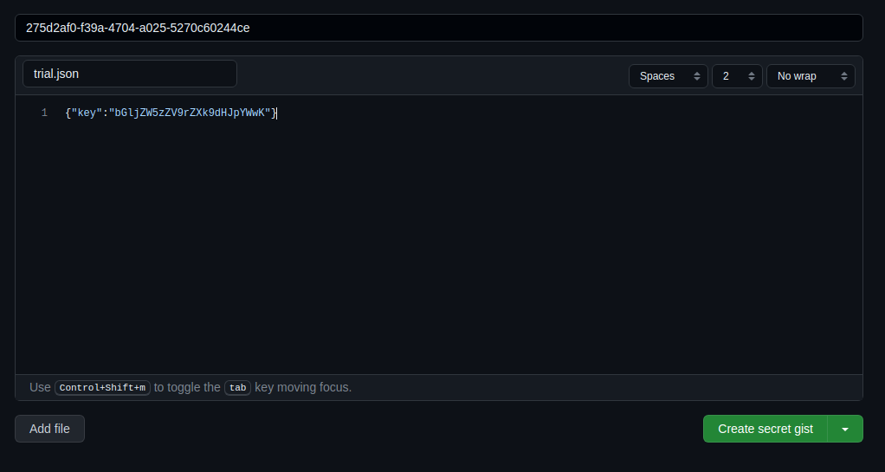
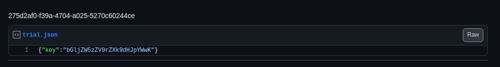
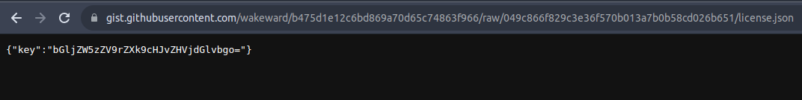

# Scenario: Cease and Desist

- [Learning Outcomes](#learning-outcomes)
- [Challenge Description](#challenge-description)
- [Guided Walkthrough](#guided-walkthrough)
  - [Step 1: Enumerate resources and finding licensing server password](#step-1-enumerate-resources-and-finding-licensing-server-password)
  - [Step 2: Reviewing the Cilium Network Policy](#step-2-reviewing-the-cilium-network-policy)
  - [Step 3: Accessing the licensing server, activating the trial license and capture the first flag](#step-3-accessing-the-licensing-server-activating-the-trial-license-and-capture-the-first-flag)
  - [Step 4: Analyzing the trial license and creating a GitHub Gist](#step-4-analyzing-the-trial-license-and-creating-a-github-gist)
  - [Step 5: Modifying the license file and activating the license server](#step-5-modifying-the-license-file-and-activating-the-license-server)
  - [Step 6: Enumerate the production namespace and capture the second flag](#step-6-enumerate-the-production-namespace-and-capture-the-second-flag)
- [Remediation and Security Considerations](#remediation-and-security-considerations)

## Learning Outcomes

The purpose of Cease and Desist is to teach participants about Cilium and how Cilium network policy can be used to restrict layer 3 and layer 7 traffic. This scenario also demonstrates how to use `kubectl` to enumerate resources so that key resources are discovered and used to solve the challenge.

## Challenge Description

```
                                _______________________
                              =(__    ___      __     _)=
                                |                     |
                                |                     |
                                |  Cease and Desist!  |
                                |                     |
                                |                     |
                                |     Reform-Kube     |
                                |                     |
                                |                     |
                                |                     |
                                |__    ___   __    ___|
                              =(_______________________)=

Production is Down! Your organization is using reform-kube, an OS Kubernetes management project.

Unfortunately, reform-kube has changed their licensing model and is no longer open source.

Login to the licensing server and see if you can resolve the issue to get Production up and running.
```

## Guided Walkthrough

### Step 1: Enumerate resources and finding licensing server password

The first step is to enumerate resources. Looking through the file system of the container does not reveal anything useful but we can review the permissions of the service account by using:

```bash
root@admin-console:~# kubectl auth can-i --list
Resources                                       Non-Resource URLs                     Resource Names   Verbs
selfsubjectaccessreviews.authorization.k8s.io   []                                    []               [create]
selfsubjectrulesreviews.authorization.k8s.io    []                                    []               [create]
namespaces                                      []                                    []               [get list]
secrets                                         []                                    []               [get list]
                                                [/.well-known/openid-configuration]   []               [get]
                                                [/api/*]                              []               [get]
                                                [/api]                                []               [get]
                                                [/apis/*]                             []               [get]
                                                [/apis]                               []               [get]
                                                [/healthz]                            []               [get]
                                                [/healthz]                            []               [get]
                                                [/livez]                              []               [get]
                                                [/livez]                              []               [get]
                                                [/openapi/*]                          []               [get]
                                                [/openapi]                            []               [get]
                                                [/openid/v1/jwks]                     []               [get]
                                                [/readyz]                             []               [get]
                                                [/readyz]                             []               [get]
                                                [/version/]                           []               [get]
                                                [/version/]                           []               [get]
                                                [/version]                            []               [get]
                                                [/version]                            []               [get]
```

Immediately we can see that we have access to `secrets` and `namespaces`. Let's see if there are any secrets in our current namespace:

```bash
root@admin-console:~# kubectl get secrets
NAME            TYPE     DATA   AGE
rkls-password   Opaque   1      5m17s
```

It looks like the password for the reform-kube licensing server is stored in a secret. We can pull the secret with the following command:

```bash
root@admin-console:~# kubectl get secrets -o jsonpath='{.data.password}' | base64 -d
access-2-reform-kube-server
```

Great, let's make a note of this password and continue to enumerate the resources. We have permissions to view namespaces.

```bash
root@admin-console:~# kubectl get namespaces
NAME              STATUS   AGE
administration    Active   65m
default           Active   67m
kube-node-lease   Active   67m
kube-public       Active   67m
kube-system       Active   67m
licensing         Active   65m
production        Active   65m
```

It looks like we have three non-standard namespaces, `administration`, `licensing` and `production`. Let's run `auth can-i` on these namespaces to see what permissions we have:

```bash
root@admin-console:~# kubectl auth can-i --list -n administration
Resources                                       Non-Resource URLs                     Resource Names   Verbs
selfsubjectaccessreviews.authorization.k8s.io   []                                    []               [create]
selfsubjectrulesreviews.authorization.k8s.io    []                                    []               [create]
namespaces                                      []                                    []               [get list]
secrets                                         []                                    []               [get list]
                                                [/.well-known/openid-configuration]   []               [get]
                                                [/api/*]                              []               [get]
                                                [/api]                                []               [get]
                                                [/apis/*]                             []               [get]
                                                [/apis]                               []               [get]
                                                [/healthz]                            []               [get]
                                                [/healthz]                            []               [get]
                                                [/livez]                              []               [get]
                                                [/livez]                              []               [get]
                                                [/openapi/*]                          []               [get]
                                                [/openapi]                            []               [get]
                                                [/openid/v1/jwks]                     []               [get]
                                                [/readyz]                             []               [get]
                                                [/readyz]                             []               [get]
                                                [/version/]                           []               [get]
                                                [/version/]                           []               [get]
                                                [/version]                            []               [get]
                                                [/version]                            []               [get]
```

```bash
root@admin-console:~# kubectl auth can-i --list -n production
Resources                                       Non-Resource URLs                     Resource Names   Verbs
selfsubjectaccessreviews.authorization.k8s.io   []                                    []               [create]
selfsubjectrulesreviews.authorization.k8s.io    []                                    []               [create]
namespaces                                      []                                    []               [get list]
pods                                            []                                    []               [get list]
                                                [/.well-known/openid-configuration]   []               [get]
                                                [/api/*]                              []               [get]
                                                [/api]                                []               [get]
                                                [/apis/*]                             []               [get]
                                                [/apis]                               []               [get]
                                                [/healthz]                            []               [get]
                                                [/healthz]                            []               [get]
                                                [/livez]                              []               [get]
                                                [/livez]                              []               [get]
                                                [/openapi/*]                          []               [get]
                                                [/openapi]                            []               [get]
                                                [/openid/v1/jwks]                     []               [get]
                                                [/readyz]                             []               [get]
                                                [/readyz]                             []               [get]
                                                [/version/]                           []               [get]
                                                [/version/]                           []               [get]
                                                [/version]                            []               [get]
                                                [/version]                            []               [get]
```

```bash
root@admin-console:~# kubectl auth can-i --list -n licensing
Resources                                       Non-Resource URLs                     Resource Names   Verbs
pods/exec                                       []                                    []               [create]
selfsubjectaccessreviews.authorization.k8s.io   []                                    []               [create]
selfsubjectrulesreviews.authorization.k8s.io    []                                    []               [create]
namespaces                                      []                                    []               [get list]
pods                                            []                                    []               [get list]
                                                [/.well-known/openid-configuration]   []               [get]
                                                [/api/*]                              []               [get]
                                                [/api]                                []               [get]
                                                [/apis/*]                             []               [get]
                                                [/apis]                               []               [get]
                                                [/healthz]                            []               [get]
                                                [/healthz]                            []               [get]
                                                [/livez]                              []               [get]
                                                [/livez]                              []               [get]
                                                [/openapi/*]                          []               [get]
                                                [/openapi]                            []               [get]
                                                [/openid/v1/jwks]                     []               [get]
                                                [/readyz]                             []               [get]
                                                [/readyz]                             []               [get]
                                                [/version/]                           []               [get]
                                                [/version/]                           []               [get]
                                                [/version]                            []               [get]
                                                [/version]                            []               [get]
ciliumnetworkpolicies.cilium.io                 []                                    [rkls-egress]    [get]
ciliumnetworkpolicies.cilium.io                 []                                    []               [list]
```

The `administration` namespace returns our first enumeration of permissions, so we have confirmed the namespace the `admin-console` is in. The `production` namespace returns permissions to view pods, so let's see what pods are running in the `production` namespace:

```bash
root@admin-console:~# kubectl get pods -n production
No resources found in production namespace.
```

As expected based on the challenge description, there are no pods running in the `production` namespace. Our objective is to get production up and running again. Let's turn our attention to the `licensing` namespace. We have permissions to `get` and `list` pods as well as `create` for `pods/exec`. This combination of permissions allows us to `exec` into a pod and run commands but before we do that, we also have a permissions to `ciliumnetworkpolicies.cilium.io`. But what is cilium and what is a cilium network policy?

### Step 2: Reviewing the Cilium Network Policy

According to the [Cilium Website](https://docs.cilium.io/en/stable/overview/intro/), *Cilium is open source software for transparently securing the network connectivity between application services deployed using Linux container management platforms like Docker and Kubernetes*. Cilium leverages extended Berkeley Packet Filter (eBPF) to provide a number of features including:

- the ability to filter on individual application protocol requests such as only allowing HTTP GET requests to a specific path
- traditional CIDR based security policies for both ingress and egress traffic
- use security identities to group application containers traffic and validate it at the receiving node
- observability of network traffic using metadata to enrich the troubleshooting experience

To restrict ingress and egress traffic, Cilium uses [Cilium network policies](https://docs.cilium.io/en/stable/security/policy/) and the rule sets are defined as a set of allowlists. These are supported at layers 3 and 7, and can be applied to an endpoint (via a Kubernetes LabelSelector) or node.

Now we understand what Cilium is, let's review the Cilium network policy that is in the `licensing` namespace:

```bash
root@admin-console:~# kubectl get cnp -n licensing
NAME              AGE
kube-api-access   77m
rkls-egress       77m
```

We know based on our RBAC permissions that we can only `get` the `rkls-egress` Cilium network policy. Let's review the policy:

```bash
root@admin-console:~# kubectl get cnp rkls-egress -n licensing -oyaml
```

```yaml
apiVersion: cilium.io/v2
kind: CiliumNetworkPolicy
metadata:
  annotations:
    kubectl.kubernetes.io/last-applied-configuration: |
      {"apiVersion":"cilium.io/v2","kind":"CiliumNetworkPolicy","metadata":{"annotations":{},"name":"rkls-egress","namespace":"licensing"},"spec":{"egress":[{"toEndpoints":[{"matchLabels":{"k8s:io.kubernetes.pod.namespace":"kube-system","k8s:k8s-app":"kube-dns"}}],"toPorts":[{"ports":[{"port":"53","protocol":"ANY"}],"rules":{"dns":[{"matchPattern":"*"}]}}]},{"toFQDNs":[{"matchName":"reform-kube.licensing.com.org.test.dev.io"},{"matchName":"deb.debian.org"},{"matchPattern":"*.debian.org"},{"matchName":"debian.map.fastlydns.net"},{"matchName":"packages.cloud.google.com"},{"matchName":"github.com"},{"matchPattern":"*.github.com"},{"matchPattern":"*.githubusercontent.com"},{"matchName":"control-plane.io"},{"matchName":"ident.me"}],"toPorts":[{"ports":[{"port":"443","protocol":"TCP"},{"port":"80","protocol":"TCP"}]}]}],"endpointSelector":{"matchLabels":{"k8s:name":"rkls"}}}}
  creationTimestamp: "2023-11-23T10:12:11Z"
  generation: 1
  name: rkls-egress
  namespace: licensing
  resourceVersion: "833"
  uid: ffd6ce46-fbdc-4d82-974c-4869e5ddcf36
spec:
  egress:
  - toEndpoints:
    - matchLabels:
        k8s:io.kubernetes.pod.namespace: kube-system
        k8s:k8s-app: kube-dns
    toPorts:
    - ports:
      - port: "53"
        protocol: ANY
      rules:
        dns:
        - matchPattern: '*'
  - toFQDNs:
    - matchName: reform-kube.licensing.com.org.test.dev.io
    - matchName: deb.debian.org
    - matchPattern: '*.debian.org'
    - matchName: debian.map.fastlydns.net
    - matchName: packages.cloud.google.com
    - matchName: github.com
    - matchPattern: '*.github.com'
    - matchPattern: '*.githubusercontent.com'
    - matchName: control-plane.io
    - matchName: ident.me
    toPorts:
    - ports:
      - port: "443"
        protocol: TCP
      - port: "80"
        protocol: TCP
  endpointSelector:
    matchLabels:
      k8s:name: rkls
```

There is a lot of configuration defined in this network policy, so let's break it down.

1. The first egress rule is to allow traffic to the `kube-dns` service in the `kube-system` namespace on port 53. This is required for DNS resolution.
2. The second egress rule is to allow traffic to a number of Fully Qualified Domain Names (FQDNs) on ports 443 and 80. It seems we have the licensing endpoint, a number of Debian package repositories, GitHub and a few other domains.
3. The last part of the network policy is the endpoint selector. This is used to select the pods that the network policy will be applied to. In this case, the network policy is applied to pods with the label `k8s:name: rkls` which is likely the reform-kube licensing server.

Now we understand the Cilium network policy, let's see if we can find the licensing server.

### Step 3: Accessing the licensing server, activating the trial license and capture the first flag

A quick enumeration of the pods in the `licensing` namespace reveals the licensing server:

```bash
root@admin-console:~# kubectl get pods -n licensing
NAME   READY   STATUS    RESTARTS   AGE
rkls   1/1     Running   0          82m
```

As previously discussed, we have permissions to `exec` into the pod. Let's try that.

```bash
root@admin-console:~# kubectl exec -it rkls -n licensing -- /bin/bash
licenser@rkls:/$
```

Great, we have access so now we need to find the actual licensing server binary and see what the issue is.

```bash
licenser@rkls:/$ ls -la
total 60
drwxr-xr-x   1 root     root     4096 Nov 23 10:13 .
drwxr-xr-x   1 root     root     4096 Nov 23 10:13 ..
lrwxrwxrwx   1 root     root        7 Aug 14 00:00 bin -> usr/bin
drwxr-xr-x   2 root     root     4096 Jun 11 15:00 boot
drwxr-xr-x   5 root     root      360 Nov 23 10:13 dev
drwxr-xr-x   1 root     root     4096 Nov 23 10:13 etc
drwxr-xr-x   1 root     root     4096 Oct  7 09:55 home
lrwxrwxrwx   1 root     root        7 Aug 14 00:00 lib -> usr/lib
lrwxrwxrwx   1 root     root        9 Aug 14 00:00 lib32 -> usr/lib32
lrwxrwxrwx   1 root     root        9 Aug 14 00:00 lib64 -> usr/lib64
lrwxrwxrwx   1 root     root       10 Aug 14 00:00 libx32 -> usr/libx32
drwxr-xr-x   2 root     root     4096 Aug 14 00:00 media
drwxr-xr-x   2 root     root     4096 Aug 14 00:00 mnt
drwxr-xr-x   2 root     root     4096 Aug 14 00:00 opt
dr-xr-xr-x 183 root     root        0 Nov 23 10:13 proc
drwxr-xr-x   2 licenser licenser 4096 Nov  2 16:31 reform-kube
drwx------   2 root     root     4096 Aug 14 00:00 root
drwxr-xr-x   1 root     root     4096 Nov 23 10:13 run
lrwxrwxrwx   1 root     root        8 Aug 14 00:00 sbin -> usr/sbin
drwxr-xr-x   2 root     root     4096 Aug 14 00:00 srv
dr-xr-xr-x  13 root     root        0 Nov 23 10:13 sys
drwxrwxrwt   1 root     root     4096 Oct  7 09:55 tmp
drwxr-xr-x   1 root     root     4096 Aug 14 00:00 usr
drwxr-xr-x   1 root     root     4096 Aug 14 00:00 var
```

A quick `ls` of top directory reveals a `reform-kube` directory. Let's see what is in there.

```bash
licenser@rkls:/reform-kube$ ls -la
total 4936
drwxr-xr-x 2 licenser licenser    4096 Nov  2 16:31 .
drwxr-xr-x 1 root     root        4096 Nov 23 10:13 ..
-rwxr-xr-x 1 licenser licenser 5046272 Nov  2 16:31 reform-kube-licensing-server
licenser@rkls:/reform-kube$
```

We have found the licensing server binary. Let's try and run it.

```bash
licenser@rkls:/reform-kube$ ./reform-kube-licensing-server
Password not set
```

We receive a message about no password being set, fortunately we have the password from the secret we found early but we need to understand how to parse it. Let's try and run a `help` command to determine what options are available.

```bash
licenser@rkls:/reform-kube$ ./reform-kube-licensing-server --help
Usage of ./reform-kube-licensing-server:
  -h	Display help
  -licenseURL string
    	Licensing server URL (default "https://reform-kube.licensing.com.org.test.dev.io")
  -password string
    	Licensing server Password
  -trial
    	Enable program trial mode
```

Okay. so we need to use the `-password` flag to set the password. It also runs a default licensing server URL, so we can see what happens with that. There is also a `-trial` flag which we can also try.

```bash
licenser@rkls:/reform-kube$ ./reform-kube-licensing-server -password access-2-reform-kube-server
error contacting licensing server Get "https://reform-kube.licensing.com.org.test.dev.io": dial tcp: lookup reform-kube.licensing.com.org.test.dev.io on 10.96.0.10:53: no such host
```

It look like we found the issue, the licensing server cannot resolve the domain name. We know it is allow-listed in the Cilium network policy, so let's try and run the licensing server with the `-trial` flag instead.

```bash
licenser@rkls:/reform-kube$ ./reform-kube-licensing-server -password access-2-reform-kube-server -trial
Trial mode enabled
FLAG: flag_ctf{A_FREE_SAMPLE_4_YOU_2_TRY}
```

Great, we have the first flag. It seems that we have received a "free sample" to try, so let's have a look in the directory for anything else that might be useful.

```bash
licenser@rkls:/reform-kube$ ls -la
total 4940
drwxr-xr-x 1 licenser licenser    4096 Nov 23 11:46 .
drwxr-xr-x 1 root     root        4096 Nov 23 10:13 ..
-r--r--r-- 1 licenser licenser      34 Nov 23 11:46 license.json
-rwxr-xr-x 1 licenser licenser 5046272 Nov  2 16:31 reform-kube-licensing-server
```

Interesting, we now have licensing file. Let's see what is in it.

### Step 4: Analyzing the trial license and creating a GitHub Gist

The `license.json` file is a simple JSON file with a single key `key` and a value that looks base64 encoded.

```json
{"key":"bGljZW5zZV9rZXk9dHJpYWwK"}
```

Let's decode the value and see what is in it.

```bash
licenser@rkls:/reform-kube$ echo "bGljZW5zZV9rZXk9dHJpYWwK" | base64 -d
license_key=trial
```

The value decodes to `license_key=trial`. So we now have a license key which we can use for the licensing server. Unfortunately, we cannot setup our own local server to test this against as we are restricted by the Cilium network policy. But if we remember the FQDN allowed in the Cilium network policy, we can use GitHub to host a Gist and use that as our licensing server. Let's create a Gist and host our trial license key.

Navigate to `https://gist.github.com/` and click on the `+` icon in the top right corner. Paste the license key into the Gist and click `Create secret gist`. We now have a Gist that we can use as our licensing server.



Click on the raw value and copy the url of your Gist. We can now use this as our licensing server URL. 

> Note: Despite the gist being 'secret', it can still be accessed by the URL directly.



Our licensing URL should look like this: `https://gist.githubusercontent.com/wakeward/5224313fc51bcfbee5a40e58885aff87/raw/48919f37ddb76a9686bb9c93a8f2a44bc0ca5431/trial.json`

Let's try and run the licensing server again with the new licensing URL.

```bash
licenser@rkls:/reform-kube$ ./reform-kube-licensing-server -password access-2-reform-kube-server -licenseURL https://gist.githubusercontent.com/wakeward/5224313fc51bcfbee5a40e58885aff87/raw/48919f37ddb76a9686bb9c93a8f2a44bc0ca5431/trial.json
production license key required
```

Darn, it looks like we need a production license key. Let's see if we can craft one.

### Step 5: Modifying the license file and activating the license server

As we saw earlier our license file equates to `license_key=trial`. Let's try and change that to `license_key=production` and see what happens. First we need base64 encode the new value.

```bash
licenser@rkls:/reform-kube$ echo "license_key=production" | base64
bGljZW5zZV9rZXk9cHJvZHVjdGlvbgo=
```

Now let's create a new Gist with the new value and update the licensing server URL.



Let's use this new URL and see what happens.

```bash
licenser@rkls:/reform-kube$ ./reform-kube-licensing-server -licenseURL https://gist.githubusercontent.com/wakeward/b475d1e12c6bd869a70d65c74863f966/raw/049c866f829c3e36f570b013a7b0b58cd026b651/license.json -password access-2-reform-kube-server
Product activation successful
```

Excellent, we've successfully activated the license server. Let's see if we have restored production.

### Step 6: Enumerate the production namespace and capture the second flag

We can re-run our `kubectl get pods` command to see if there are any pods running in the `production` namespace.

> Note: We need to return to the `admin-console` pod or use the service account token associated with it to access the `production` namespace.

```bash
root@admin-console:/# kubectl get pods -n production
NAME              READY   STATUS    RESTARTS   AGE
tokungfu-server   1/1     Running   0          2m55s
```

A new pod has started up in production called `tokungfu-server`. Let's examine the pod further.

```bash
root@admin-console:/# kubectl get pods tokungfu-server -n production -oyaml
```

```yaml
apiVersion: v1
kind: Pod
metadata:
  creationTimestamp: "2023-11-23T13:27:49Z"
  name: tokungfu-server
  namespace: production
  resourceVersion: "1849"
  uid: 8622890f-0d8f-43e1-88ad-b44bd9dcb52d
spec:
  containers:
  - env:
    - name: FLAG
      valueFrom:
        secretKeyRef:
          key: flag
          name: flag
    image: docker.io/controlplaneoffsec/cease-and-desist:tokungfu-shop
    imagePullPolicy: IfNotPresent
    name: tokungfu-server
    ports:
    - containerPort: 8080
      name: http
      protocol: TCP
    resources: {}
    terminationMessagePath: /dev/termination-log
    terminationMessagePolicy: File
    volumeMounts:
    - mountPath: /var/run/secrets/kubernetes.io/serviceaccount
      name: kube-api-access-d7xrd
      readOnly: true
  dnsPolicy: ClusterFirst
  enableServiceLinks: true
  nodeName: k8s-node-0
  preemptionPolicy: PreemptLowerPriority
  priority: 0
  restartPolicy: Always
  schedulerName: default-scheduler
  securityContext: {}
  serviceAccount: default
  serviceAccountName: default
  terminationGracePeriodSeconds: 30
  tolerations:
  - effect: NoExecute
    key: node.kubernetes.io/not-ready
    operator: Exists
    tolerationSeconds: 300
  - effect: NoExecute
    key: node.kubernetes.io/unreachable
    operator: Exists
    tolerationSeconds: 300
  volumes:
  - name: kube-api-access-d7xrd
    projected:
      defaultMode: 420
      sources:
      - serviceAccountToken:
          expirationSeconds: 3607
          path: token
      - configMap:
          items:
          - key: ca.crt
            path: ca.crt
          name: kube-root-ca.crt
      - downwardAPI:
          items:
          - fieldRef:
              apiVersion: v1
              fieldPath: metadata.namespace
            path: namespace
status:
  conditions:
  - lastProbeTime: null
    lastTransitionTime: "2023-11-23T13:27:49Z"
    status: "True"
    type: Initialized
  - lastProbeTime: null
    lastTransitionTime: "2023-11-23T13:27:54Z"
    status: "True"
    type: Ready
  - lastProbeTime: null
    lastTransitionTime: "2023-11-23T13:27:54Z"
    status: "True"
    type: ContainersReady
  - lastProbeTime: null
    lastTransitionTime: "2023-11-23T13:27:49Z"
    status: "True"
    type: PodScheduled
  containerStatuses:
  - containerID: containerd://9824d28bea635830d8aae16236d1c509e1cc38ac58cf164fc308939b71c00ce7
    image: docker.io/controlplaneoffsec/cease-and-desist:tokungfu-shop
    imageID: docker.io/controlplaneoffsec/cease-and-desist@sha256:8f3bfb2503352c16531269244b470ffe87e42bee12b19be7336881c8cbe8906a
    lastState: {}
    name: tokungfu-server
    ready: true
    restartCount: 0
    started: true
    state:
      running:
        startedAt: "2023-11-23T13:27:53Z"
  hostIP: 172.31.2.166
  phase: Running
  podIP: 10.0.2.211
  podIPs:
  - ip: 10.0.2.211
  qosClass: BestEffort
  startTime: "2023-11-23T13:27:49Z"
```

From the output we can see that the pod uses a Kubernetes secret called `flag` to set an environment variable called `FLAG` so we'll need to access the pod to obtain it. Fortunately there is http port open on 8080, so let's try and access it. To do that we'll need the Pod IP address which in this instance is `10.0.2.211`.

```bash
root@admin-console:/# curl http://10.0.2.211:8080
"Tokungfu Shop Running: flag_ctf{OPEN_WIDE_AND_EAT_SOME_TOFU}"
```

Congratulations, you have found the final flag and solved Cease and Desist.

## Remediation and Security Considerations

This CTF scenario does not have a remediation plan as it is to demonstrate how Cilium network policy can be used to restrict layer 3 and layer 7 traffic. However, there are a number of security considerations:

- Cilium is a powerful tool which can be used for securing network connectivity within Kubernetes, allowing transparent encryption of network traffic between services, traffic observability and network policy enforcement.
- A typical layer 7 egress restriction pattern is to run a reverse proxy within a dedicated namespace or node which all workloads are forced to use. With Cilium, this can be achieved with Cilium network policies but with unified layer 3 and layer 7 egress restrictions.
- Overly permissive egress allowed access to an endpoint service arbitrary, attacker controlled content. This under a large amount of the security provided by filtering egress in the first place. 