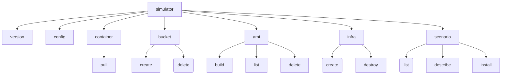

# Simulator CLI



[//]: # "TODO document commands"

## Configuration

The Simulator ClI is configured using the `simulator config` command.

By default, this writes its configuration file `config.yaml` to the following
directories according to the target operating system family:

| OS Family | Directory                                                                            |
| --------- | ------------------------------------------------------------------------------------ |
| Linux     | $XDG_CONFIG_HOME/.config/simulator - defaults to /home/$USER/.config/simulator       |
| Windows   | %LOCALAPPDATA%/simulator - default to C:\Users\$env:USERNAME\AppData\Local\simulator |
| MacOS     | $HOME/Library/Preferences/io.controlplane.simulator                                  |

This can be changed to an alternative directory by setting the environment variable
`SIMULATOR_DIR` to define the directory to use.

The following flags can be used to configure the Simulator CLI.

| Name      | Description                                                                                                     |
| --------- | --------------------------------------------------------------------------------------------------------------- |
| name      | Used as the name, or name prefix for the Terraform created resources. Defaults to simulator.                    |
| bucket    | The name of the S3 bucket to store Terraform state. Can be an existing bucket that you own. MUST be configured. |
| dev       | Used to set the Simulator CLI into developer mode when working on new scenarios.                                |
| rootless  | Used when running rootless Docker, to allow local directories to be written to from the container.              |
| print-dir | Print configuration directory                                                                                   |

[//]: # "TODO: document scenario development and link"

A minimal configuration file will look like the following.

```yaml
name: simulator
bucket: <your-s3-bucket>
container:
  image: controlplane/simulator:latest
```
