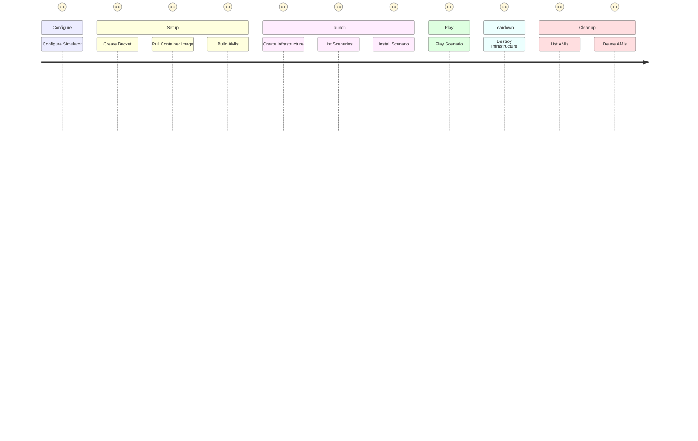

# Getting Started

This document provides details of how to get started using the Simulator CLI.



## Configure

The Simulator CLI is driven from a configuration file `config.yaml`.

By default, this is created in `$HOME/.simulator` but this can be changed to an alternative location by
setting the `SIMULATOR_DIR` environment variable.

The minimal configuration required is to set the name of the S3 bucket where the Terraform state will be stored. This
can be achieved by running the following command.

```shell
simulator config --bucket <name>
```

If you are running Docker in [Rootless mode](https://docs.docker.com/engine/security/rootless/), you also need to
configure the Simulator CLI for this to ensure that the required files can be created when running the later commands.

```shell
simulator config --bucket <name> --rootless
```

## Setup

There are three prerequisite steps to perform to setup your local and AWS environment before you can launch the
infrastructure and play the scenarios.

1. Create the S3 bucket to store the Terraform state
2. Pull the Simulator Container image containing the configuration and tools to manage the infrastructure and scenarios
3. Create the two AMIs in your AWS account required for the infrastructure

Run the following commands to perform these steps.

```shell
simulator bucket create
simulator container pull
for i in bastion k8s; do
  simulator ami build $i
done
```

## Launch

The following steps will create the infrastructure, list the available scenarios, and install the selected scenario into
the cluster for you to play.

```shell
simulator infra create
simulator scenario list
```

Choose the scenario you want to play, and using the id, install it into the cluster.

```shell
simulator scenario install <id>
```

## Play

With the infrastructure provisioned and the scenario installed, it's time to play!

A Player bundle has been created that will allow you SSH directly into the starting point for the selected scenario.

This will either be in `$HOME/.simulator/player` or `$SIMULATOR_DIR/player` depending on whether you used the defaults
or a custom directory for the configuration. From here simple SSH to access the scenario.

```shell
ssh -F simulator_config bastion
```

If you need some help, there are walkthroughs in the [docs](../docs) folder.

## Teardown

When no longer required, teardown the infrastructure.

```shell
simulator infra destroy
```

## Cleanup

When no longer required, find and delete the AMIs in your AWS account

```shell
simulator ami list
simulator ami delete <id>
```
