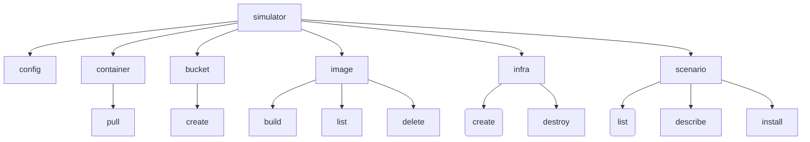

# Simulator CLI

```mermaid
flowchart TD
  simulator --> config
  simulator --> container
  simulator --> bucket
  simulator --> image
  simulator --> infra
  simulator --> scenario
  container --> pull
  bucket --> create
  image --> build
  image --> list
  image --> delete
  infra --> c(create)
  infra --> destroy
  scenario --> s(list)
  scenario --> describe
  scenario --> install
```
